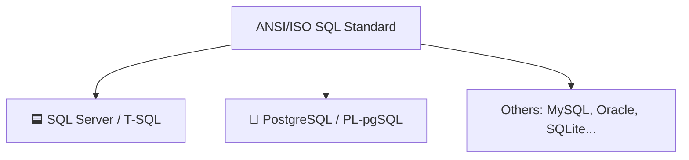

# What Is SQL & the Two Engines

## 🧠 Intuition

**SQL** (Structured Query Language) is the language for talking to **relational databases** — data
organized into tables of rows and columns. You describe *what* you want ("all customers in
Germany"), and the database figures out *how* to get it. That's the magic: SQL is **declarative**.
You don't write loops to scan files; you state the result you want and the engine's **query
optimizer** plans the fastest way to produce it.

> 💡 **Analogy — ordering at a restaurant.** You tell the waiter "a medium steak with fries"
> (declarative). You don't go into the kitchen and operate the grill (imperative). SQL is the order;
> the database is the kitchen; the query optimizer is the chef deciding how to cook it fastest.

A **relational database management system (RDBMS)** is the software that stores the tables and runs
your SQL. The two you'll learn here are the two most important in the business world:

- **🟦 Microsoft SQL Server** — the dominant enterprise RDBMS in the .NET / Windows / Azure world.
  Its dialect of SQL is called **T-SQL** (Transact-SQL).
- **🐘 PostgreSQL** — the leading open-source RDBMS, beloved for standards compliance, extensibility,
  and rich data types. Its procedural language is **PL/pgSQL**.

## 📐 SQL is a standard with dialects

There's an official ANSI/ISO SQL standard, and both engines implement most of it. So **~80% of
what you write is identical** on both. The remaining ~20% — data type names, paging, identity
columns, upsert, string/date functions, JSON, the procedural language — is where they diverge, and
that's exactly what this course highlights with side-by-side **🟦 / 🐘** comparisons.



| | 🟦 SQL Server | 🐘 PostgreSQL |
|--|--------------|---------------|
| Vendor | Microsoft (commercial; free Express/Developer editions) | Open source (free, community-governed) |
| Dialect | T-SQL | SQL + PL/pgSQL |
| Runs on | Windows, Linux, containers, Azure SQL | Windows, Linux, macOS, containers, every cloud |
| Default tooling | SSMS, Azure Data Studio | psql, pgAdmin |
| Identity | `IDENTITY` | `GENERATED ... AS IDENTITY` / `SERIAL` |
| String type | `NVARCHAR` (Unicode) | `text` / `varchar` |
| Top-N | `SELECT TOP 10 ...` | `... LIMIT 10` |
| "Now" | `GETDATE()` / `SYSUTCDATETIME()` | `now()` / `CURRENT_TIMESTAMP` |
| Concurrency default | Locking (+ optional snapshot) | **MVCC** (multi-version) |

Neither is "better" — they're different tools. Knowing both makes you portable and far more
employable.

## 💻 The same query on both engines

"Top 3 most expensive products" — almost identical, one keyword differs:

```sql
-- 🟦 SQL Server
SELECT TOP 3 name, unit_price
FROM products
ORDER BY unit_price DESC;
```
```sql
-- 🐘 PostgreSQL
SELECT name, unit_price
FROM products
ORDER BY unit_price DESC
LIMIT 3;
```

Same `SELECT`, same `ORDER BY` — only the row-limiting syntax differs. That's the pattern for the
whole course.

## 🛠️ Getting set up

You don't need both to start, but the course shows both. Quick options:

**🟦 SQL Server** (any one):
- **Docker:** `docker run -e "ACCEPT_EULA=Y" -e "MSSQL_SA_PASSWORD=Your_password123" -p 1433:1433 -d mcr.microsoft.com/mssql/server:2022-latest`
- **SQL Server Developer Edition** (free, full-featured) + **SSMS** or **Azure Data Studio**.
- **Azure SQL Database** (cloud, free tier available).

**🐘 PostgreSQL** (any one):
- **Docker:** `docker run -e POSTGRES_PASSWORD=postgres -p 5432:5432 -d postgres:17`
- **Native installer** from postgresql.org + **pgAdmin** or the **psql** CLI.
- Any managed cloud Postgres (Azure, AWS RDS, Supabase, Neon…).

Then load the [sample database](../SAMPLE-DATABASE.md) and you can run every example in this course.

## ⚖️ How declarative SQL changes your thinking

The biggest beginner adjustment: **think in sets, not loops.** "For each customer, add up their
orders" becomes one `GROUP BY` query that the engine runs efficiently — not a loop in your
application fetching one customer at a time (the dreaded **N+1**, see
[Anti-Patterns](../13-Best-Practices-and-Interview/02.Anti-Patterns.md)). The whole course trains
this set-based mindset.

## 🚫 Common beginner misconceptions

- *"SQL is the same everywhere."* — The core is; the details (types, paging, functions, procedural
  code) differ per engine. This course is built around those differences.
- *"I write the execution steps."* — No. You declare the result; the **optimizer** decides the
  steps. You influence it via indexes and SARGable queries
  ([Module 06](../06-Indexing-and-Performance/README.md)), not by hand-coding the plan.
- *"NoSQL replaced SQL."* — Relational databases run most of the world's transactional data, and
  both engines now handle JSON, documents, and vectors too
  ([Module 08](../08-Specialized-Data/README.md)).

## 🎯 Practice (with full solutions)

### 1. Spot the dialect — `Easy`
**Task:** Which engine is each snippet, and what does it do?
(a) `SELECT TOP 5 * FROM orders;`  (b) `SELECT * FROM orders LIMIT 5;`  (c) `SELECT GETDATE();`
(d) `SELECT now();`
**Solution:** (a) 🟦 SQL Server — first 5 orders. (b) 🐘 PostgreSQL — first 5 orders. (c) 🟦 — current
date/time. (d) 🐘 — current date/time. (a)/(b) do the *same thing* with different syntax; same for
(c)/(d).
**Why it matters:** recognizing the dialect from a snippet is a core skill this course builds.

### 2. Write it both ways — `Easy`
**Task:** Return the 2 customers who joined most recently (by `created_at`), in both dialects.
**Solution:**
```sql
-- 🟦 SQL Server
SELECT TOP 2 name, created_at FROM customers ORDER BY created_at DESC;
```
```sql
-- 🐘 PostgreSQL
SELECT name, created_at FROM customers ORDER BY created_at DESC LIMIT 2;
```
**Why it works:** the logic (sort newest-first, take 2) is identical; only the row-limit clause
changes. This is the shape of ~all dialect differences.

## ✅ Key Takeaways

- **SQL** is a **declarative** language for relational databases — you state the result, the
  **optimizer** plans the execution.
- This course teaches the two dominant engines: **🟦 SQL Server (T-SQL)** and **🐘 PostgreSQL**.
- ~80% of SQL is shared; the course highlights the ~20% that differs (types, paging, identity,
  upsert, functions, JSON, procedural code) with side-by-side comparisons.
- Think in **sets, not loops** — that's the mental shift from application code to SQL.
- Set up at least one engine + the [sample database](../SAMPLE-DATABASE.md) before continuing.

**Self-check:**
1. What does "declarative" mean, and who decides *how* a query runs?
2. Name three things that differ between SQL Server and PostgreSQL.
3. Why is "think in sets, not loops" the key beginner mindset?

---
◀ Prev: [Module index](README.md) · ▲ [Module index](README.md) · ▶ Next: [The Relational Model](02.Relational-Model.md)
