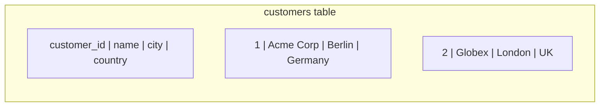

# The Relational Model

## 🧠 Intuition

The relational model organizes data into **tables** (also called *relations*). Each table is a
grid: **columns** define *what kind* of data (a customer's name, city, join date), and **rows**
hold the actual records (one specific customer). That's it — almost everything else in SQL is built
on this simple idea.

> 💡 **Analogy — a spreadsheet, but with rules.** A table looks like a spreadsheet tab, but the
> database *enforces* the rules: every value in the "unit_price" column must be a number, every
> customer must have a unique ID, an order can't reference a customer who doesn't exist. Those
> enforced rules are what make a database trustworthy where a spreadsheet is not.

The relational model was defined by E.F. Codd in 1970, and its power is that data is connected by
**values** (a shared key), not by physical pointers — so you can recombine it any way you need with
SQL.

## 📐 The building blocks

| Term | What it is | In the sample DB |
|------|-----------|------------------|
| **Table (relation)** | A set of rows with the same columns | `customers`, `orders` |
| **Row (tuple)** | One record / entity instance | one customer: `(1, 'Acme Corp', 'Berlin', ...)` |
| **Column (attribute)** | A named, typed field | `name NVARCHAR(100)` |
| **Domain** | The allowed values for a column | "a positive decimal" for `unit_price` |
| **Schema** | A namespace grouping tables | `Sales.orders`, `dbo.products` |
| **Key** | A column (or set) that identifies rows / links tables | `customer_id`, `order_id` |



### Tables (relations)

The primary structure that stores entities (`customers`) or relationships between them
(`order_items` links orders to products).

```sql
-- Works on both engines (with the type-name caveats noted later)
CREATE TABLE employees (
    employee_id INT PRIMARY KEY,
    first_name  VARCHAR(50) NOT NULL,
    last_name   VARCHAR(50) NOT NULL,
    hire_date   DATE
);
```

### Rows (tuples)

Each row is one entity instance, and values are **atomic** — one value per column, no "repeating
groups" like a comma-separated list stuffed into one cell (that violates
[First Normal Form](03.ER-Design-and-Normalization.md)).

### Columns (attributes)

Each column has a **type** that defines its domain — what it can hold (covered in
[Data Types](04.Data-Types.md)). Both engines also offer rich specialized types: spatial
(`GEOGRAPHY` / PostGIS), JSON, arrays (🐘), hierarchy (`HierarchyId` 🟦 / `ltree` 🐘).

### Schemas

A schema is a logical container and a **security boundary** — you grant permissions on a schema to
control access to all its objects at once ([Permissions](../10-Security/03.Permissions.md)).

```sql
-- 🟦 SQL Server (GO is a batch separator in SSMS, not part of SQL)
CREATE SCHEMA Sales;
GO
CREATE TABLE Sales.orders ( order_id INT PRIMARY KEY );
```
```sql
-- 🐘 PostgreSQL
CREATE SCHEMA sales;
CREATE TABLE sales.orders ( order_id INT PRIMARY KEY );
```

> 🟦 SQL Server's default schema is `dbo`; 🐘 PostgreSQL's is `public`. Unqualified table names
> resolve against the default (or your `search_path` in Postgres).

## 🔑 Keys link tables by value

The relational model connects tables through **keys**, not pointers:

- **Primary key (PK)** — uniquely identifies each row (`customers.customer_id`). One per table.
- **Foreign key (FK)** — a column whose values must match a PK in another table
  (`orders.customer_id` → `customers.customer_id`). This enforces **referential integrity**: you
  can't create an order for a customer that doesn't exist.
- **Composite key** — a key made of multiple columns (`order_items` is keyed by
  `(order_id, product_id)`).
- **Unique / alternate key** — another column guaranteed unique (e.g. an email).

| Key type | Purpose | Example |
|----------|---------|---------|
| Primary key | Unique row identifier | `customer_id INT PRIMARY KEY` |
| Foreign key | Enforce a relationship | `customer_id INT REFERENCES customers(customer_id)` |
| Composite key | Multi-column uniqueness | `PRIMARY KEY (order_id, product_id)` |
| Unique constraint | Alternate key | `email VARCHAR(255) UNIQUE` |

Full treatment in [Constraints & Keys](05.Constraints-and-Keys.md).

## 📐 Relationships

Relationships are *implemented* with foreign keys:

- **One-to-many** — one customer has many orders (FK on the "many" side: `orders.customer_id`).
- **Many-to-many** — orders and products: each order has many products, each product appears in
  many orders. Modeled with a **junction/bridge table** (`order_items`) holding two FKs.
- **One-to-one** — rarer; an FK that's also unique.
- **Self-referencing** — a row points to another row in the same table
  (`employees.manager_id → employees.employee_id`).

```sql
-- A many-to-many bridge table (works on both engines)
CREATE TABLE order_items (
    order_id   INT NOT NULL REFERENCES orders(order_id),
    product_id INT NOT NULL REFERENCES products(product_id),
    quantity   INT NOT NULL,
    PRIMARY KEY (order_id, product_id)   -- composite PK
);
```

## ⚖️ Why "by value, not by pointer" matters

Because tables connect through shared *values*, you can recombine data freely with **joins** — no
pre-defined navigation path. Want orders-by-city? Join orders → customers and group by city. Want
products-never-ordered? Left-join products to order_items and filter for nulls. The same tables
answer countless questions you never anticipated. That flexibility is the relational model's
superpower (and what NoSQL document stores trade away for raw read speed on known access patterns).

## 🚫 Common mistakes

- **Storing lists in a column** (`items = 'A,B,C'`) — breaks atomicity; you can't query, index, or
  constrain it. Use a related table ([1NF](03.ER-Design-and-Normalization.md)).
- **No primary key** — rows become indistinguishable; updates/deletes can hit the wrong row.
- **No foreign keys** — orphaned data accumulates (orders for deleted customers). Let the database
  enforce integrity.
- **Confusing schema with database** — a schema is a namespace *inside* a database, not the
  database itself.

## 🎯 Practice (with full solutions)

### 1. Identify the relationships — `Easy`
**Task:** In the [sample database](../SAMPLE-DATABASE.md), classify each relationship:
(a) customers ↔ orders, (b) orders ↔ products, (c) employees ↔ employees.
**Solution:** (a) **one-to-many** (one customer, many orders; FK `orders.customer_id`).
(b) **many-to-many** via the `order_items` bridge table. (c) **self-referencing one-to-many** (one
manager has many reports; FK `employees.manager_id`).
**Why it matters:** recognizing cardinality drives your schema design and your joins.

### 2. Fix a non-atomic design — `Medium`
**Task:** Someone modeled orders as `orders(order_id, product_list VARCHAR(MAX))` storing
`'Coffee x10, Chips x5'`. Why is this wrong, and how do you fix it?
**Solution:** It violates atomicity — you can't query "how many of product X sold," can't enforce
that products exist, can't index it, and parsing strings is fragile. Fix with a bridge table:
```sql
CREATE TABLE order_items (
    order_id   INT NOT NULL REFERENCES orders(order_id),
    product_id INT NOT NULL REFERENCES products(product_id),
    quantity   INT NOT NULL,
    PRIMARY KEY (order_id, product_id)
);
```
**Why it works:** each (order, product, quantity) is its own row — queryable, constrainable,
indexable. This is exactly the sample DB's design.

## ✅ Key Takeaways

- Data lives in **tables** (rows × typed columns); values are **atomic** (one per cell).
- Tables connect by **value through keys** (PK/FK), not physical pointers — enabling flexible joins.
- **Schemas** namespace and secure groups of tables (🟦 default `dbo`, 🐘 default `public`).
- Relationships (1-many, many-many via a bridge table, self-referencing) are implemented with
  **foreign keys**, which enforce **referential integrity**.
- Never stuff lists into a column — model them as related rows.

**Self-check:**
1. What makes a value "atomic," and why does it matter?
2. How does a foreign key enforce referential integrity?
3. How is a many-to-many relationship modeled?

---
◀ Prev: [What Is SQL & the Two Engines](01.What-Is-SQL-and-the-Two-Engines.md) · ▲ [Module index](README.md) · ▶ Next: [ER Design & Normalization](03.ER-Design-and-Normalization.md)
