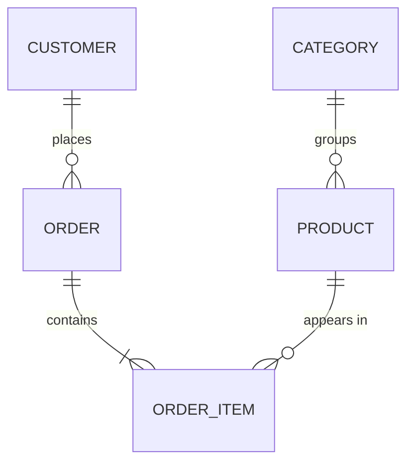

# ER Design & Normalization

## 🧠 Intuition

Before you create tables, you **design** them. **Entity-Relationship (ER) modeling** is sketching
your domain as *entities* (things: Customer, Order, Product) and *relationships* between them.
**Normalization** is then a set of rules that organize those entities so each fact is stored in
**exactly one place** — eliminating the redundancy that causes update bugs and wasted space.

> 💡 **Analogy — one source of truth.** If a customer's address is copied into every one of their
> orders, then when they move you must update dozens of rows — and if you miss one, your data now
> contradicts itself. Normalization says: store the address **once**, in the customer row, and let
> orders *refer* to the customer. Change it in one place; everyone sees the truth.

## 🎯 The Problem — an unnormalized table

```sql
-- ❌ Everything crammed into one table
CREATE TABLE orders_bad (
    order_id      INT,
    customer_name VARCHAR(100),
    customer_city VARCHAR(50),     -- repeated for every order by this customer
    product_name  VARCHAR(100),    -- one row per product → order_id repeats
    product_price DECIMAL(10,2),   -- price duplicated everywhere this product appears
    quantity      INT
);
```

Problems (the "anomalies"):
- **Update anomaly:** a product's price changes → you must update every row containing it.
- **Insertion anomaly:** can't add a new product until someone orders it.
- **Deletion anomaly:** delete the last order of a product → the product's info vanishes.
- **Redundancy:** the same customer city and product price stored hundreds of times.

Normalization systematically removes these.

## 📐 ER design first

Identify **entities**, their **attributes**, and the **relationships** (with cardinality):



Advanced ER concepts you'll meet:
- **Weak entity** — can't exist without a parent (an `order_item` needs an `order`).
- **Recursive relationship** — an entity relates to itself (`employee` → `manager`).
- **Ternary relationship** — three entities related at once (rare; often decomposed).

## 📐 The normal forms (1NF → 2NF → 3NF → BCNF)

Each form fixes a specific class of redundancy. You normalize **up to 3NF/BCNF** as a baseline.

### 1NF — atomic values, no repeating groups
Every cell holds a single value; no comma-lists, no `item1, item2, item3` columns.

```sql
-- ❌ Not 1NF: a list in one column
-- orders(order_id, items)  →  (1, 'Coffee,Chips,Tea')

-- ✅ 1NF: one row per item
CREATE TABLE order_items (
    order_id   INT,
    product_id INT,
    quantity   INT,
    PRIMARY KEY (order_id, product_id)
);
```

### 2NF — no partial dependencies
In a table with a **composite key**, every non-key column must depend on the **whole** key, not
just part of it.

```sql
-- ❌ Not 2NF: product_name depends only on product_id (part of the key), not on order_id
-- order_items(order_id, product_id, product_name, quantity)

-- ✅ 2NF: product_name moves to the Products table (keyed by product_id alone)
CREATE TABLE products (
    product_id INT PRIMARY KEY,
    name       VARCHAR(100),
    unit_price DECIMAL(10,2)
);
CREATE TABLE order_items (
    order_id   INT,
    product_id INT REFERENCES products(product_id),
    quantity   INT,
    PRIMARY KEY (order_id, product_id)
);
```

### 3NF — no transitive dependencies
A non-key column must not depend on **another non-key column**.

```sql
-- ❌ Not 3NF: department_name depends on department_id, which is a non-key column of employees
-- employees(employee_id, name, department_id, department_name)

-- ✅ 3NF: department_name moves to its own table
CREATE TABLE departments (
    department_id   INT PRIMARY KEY,
    department_name VARCHAR(100)
);
CREATE TABLE employees (
    employee_id   INT PRIMARY KEY,
    name          VARCHAR(100),
    department_id INT REFERENCES departments(department_id)
    -- department_name removed (it was a transitive dependency)
);
```

### BCNF — a stricter 3NF
Boyce-Codd Normal Form handles edge cases where a table has multiple overlapping candidate keys.
For most schemas, **3NF and BCNF coincide**; you reach for BCNF only in unusual key arrangements.
Practical rule: *"every determinant must be a candidate key."*

> The classic mnemonic: **"every non-key column depends on the key, the whole key, and nothing but
> the key, so help me Codd."** (1NF: the key. 2NF: the *whole* key. 3NF: *nothing but* the key.)

## ⚖️ When to denormalize

Normalization optimizes for **write correctness and storage**; it can cost read performance (more
joins). Sometimes you deliberately **denormalize** — store redundant data — to speed up reads:

- A **data warehouse** uses denormalized star schemas for fast analytics
  ([Module 12](../12-DataWarehousing-BI-and-Ecosystem/01.Data-Warehouse-Design.md)).
- A hot read path might cache an order's `total` rather than recomputing it from line items.
- A reporting table might duplicate a category name to avoid a join.

**Rule of thumb:** normalize to 3NF as the default, then denormalize *deliberately and
measurably* for specific read-heavy workloads — and accept the burden of keeping copies in sync
(often via [triggers](../04-Programmable-SQL/03.Triggers.md) or a [materialized view](../03-Modifying-Data-and-DDL/05.Views-and-Materialized-Views.md)).

## 🚫 Common mistakes

- **Over-normalizing** — splitting into so many tables that every query needs ten joins. Balance.
- **Premature denormalization** — duplicating data "for speed" before you've measured a problem,
  then fighting sync bugs forever.
- **No surrogate key** — using a "natural" key (like email) as the PK, then suffering when it
  changes. A surrogate (`IDENTITY`/`GENERATED`) is usually safer; see
  [Identity & Sequences](../03-Modifying-Data-and-DDL/04.Identity-and-Sequences.md).
- **Ignoring the domain** — normalization is a tool, not the goal; model what the business actually
  needs.

## 🎯 Practice (with full solutions)

### 1. Normalize to 3NF — `Medium`
**Task:** Normalize this to 3NF:
`invoices(invoice_id, customer_id, customer_email, product_id, product_name, qty, line_total)`.
**Solution:** split the mixed concerns:
```sql
CREATE TABLE customers (
    customer_id    INT PRIMARY KEY,
    customer_email VARCHAR(255) UNIQUE
);
CREATE TABLE products (
    product_id   INT PRIMARY KEY,
    product_name VARCHAR(100)
);
CREATE TABLE invoices (
    invoice_id  INT PRIMARY KEY,
    customer_id INT REFERENCES customers(customer_id)
);
CREATE TABLE invoice_lines (
    invoice_id INT REFERENCES invoices(invoice_id),
    product_id INT REFERENCES products(product_id),
    qty        INT,
    PRIMARY KEY (invoice_id, product_id)
    -- line_total removed: it's derivable (qty * product price) → don't store transitive/derived data
);
```
**Why it works:** customer email lives once (with the customer), product name once (with the
product), and `line_total` is computed when needed instead of stored redundantly.

### 2. Decide: normalize or denormalize? — `Easy`
**Task:** Your reporting dashboard runs a 6-table join thousands of times a minute and it's slow.
The underlying data changes nightly. What do you do?
**Solution:** **denormalize for the read path** — build a pre-joined reporting table or a
[materialized view](../03-Modifying-Data-and-DDL/05.Views-and-Materialized-Views.md) refreshed
nightly. Because the data only changes nightly, the sync cost is trivial and reads get fast.
**Why it matters:** normalization is the default, but read-heavy + rarely-changing data is the
textbook case for deliberate denormalization.

## ✅ Key Takeaways

- **ER modeling** sketches entities + relationships before you build tables.
- **Normalization** stores each fact once, eliminating update/insert/delete **anomalies**.
- **1NF** (atomic), **2NF** (no partial dependency on a composite key), **3NF** (no transitive
  dependency); **BCNF** is a stricter 3NF for edge cases.
- Mnemonic: depend on **the key, the whole key, and nothing but the key**.
- Normalize to **3NF by default**; **denormalize deliberately** for measured read-heavy workloads.

**Self-check:**
1. What's the difference between a partial and a transitive dependency?
2. Name the three anomalies normalization prevents.
3. When is denormalization the right call?

---
◀ Prev: [The Relational Model](02.Relational-Model.md) · ▲ [Module index](README.md) · ▶ Next: [Data Types](04.Data-Types.md)
