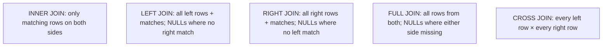

# Joins

## 🧠 Intuition

Data is split across tables (customers here, orders there) to avoid duplication
([normalization](../00-Foundations/03.ER-Design-and-Normalization.md)). A **join** stitches them
back together on a shared key, so you can ask questions that span tables: "show each order *with*
the customer's name." The *type* of join decides what happens to rows that have **no match** on the
other side.

> 💡 **Analogy — matching two guest lists.** You have a list of invitations (orders) and a list of
> people (customers). An **inner join** keeps only invitations whose person is on the people list.
> A **left join** keeps *every* invitation, filling in blanks for any whose person is missing. The
> join *type* is your policy for unmatched rows.

Joins are **highly standardized** — SQL Server and PostgreSQL agree almost entirely.

## 🎯 The Problem

```sql
-- ❌ Orders without customer names — just IDs, meaningless to a human
SELECT order_id, customer_id, order_date FROM orders;
-- order 1 → customer 1 ... who is customer 1?
```

The `customer_id` is a foreign key; to show the *name* you must join to `customers`.

## 📐 The join types



| Join | Keeps | Use when |
|------|-------|----------|
| **INNER** | Only rows with a match on both sides | "orders that have a customer" (the common case) |
| **LEFT (OUTER)** | All left rows; NULLs for missing right | "all customers, *even those with no orders*" |
| **RIGHT (OUTER)** | All right rows; NULLs for missing left | rare — usually rewritten as a LEFT join |
| **FULL (OUTER)** | All rows from both sides | reconciliation: "anything unmatched on either side" |
| **CROSS** | Every combination (Cartesian product) | generating combinations; usually accidental = bug |
| **SELF** | A table joined to itself | hierarchies (employee → manager) |

## 💻 The essentials (identical on both engines)

```sql
-- INNER JOIN: each order with its customer's name
SELECT o.order_id, c.name AS customer, o.order_date
FROM orders o
JOIN customers c ON c.customer_id = o.customer_id;     -- "JOIN" = "INNER JOIN"

-- LEFT JOIN: every customer, and their orders if any (customers with none show NULLs)
SELECT c.name, o.order_id, o.order_date
FROM customers c
LEFT JOIN orders o ON o.customer_id = c.customer_id;

-- LEFT JOIN + IS NULL: the "anti-join" — customers who have NEVER ordered
SELECT c.name
FROM customers c
LEFT JOIN orders o ON o.customer_id = c.customer_id
WHERE o.order_id IS NULL;

-- Multi-table join: order line detail with product and customer names
SELECT c.name AS customer, p.name AS product, oi.quantity, oi.unit_price
FROM orders o
JOIN customers   c  ON c.customer_id = o.customer_id
JOIN order_items oi ON oi.order_id   = o.order_id
JOIN products    p  ON p.product_id  = oi.product_id;

-- SELF JOIN: each employee with their manager's name
SELECT e.name AS employee, m.name AS manager
FROM employees e
LEFT JOIN employees m ON m.employee_id = e.manager_id;   -- LEFT so the boss (no manager) still appears
```

> **Always alias tables** (`orders o`, `customers c`) and **qualify columns** (`c.name`) in joins —
> it's clearer and avoids "ambiguous column" errors when both tables have a `name`.

## 🟦 SQL Server vs 🐘 PostgreSQL

Joins are essentially identical. The only notable differences:

| Concept | 🟦 SQL Server | 🐘 PostgreSQL |
|---------|--------------|---------------|
| Inner/left/right/full join syntax | identical | identical |
| `USING (col)` shorthand (same-named key) | ❌ not supported | ✅ `JOIN orders USING (customer_id)` |
| Natural join | ❌ | ✅ (but avoid — implicit and fragile) |
| Lateral join | `CROSS APPLY` / `OUTER APPLY` | `CROSS JOIN LATERAL` / `LEFT JOIN LATERAL` |

```sql
-- 🐘 PostgreSQL USING shorthand (when the key column has the same name on both sides)
SELECT order_id, name FROM orders JOIN customers USING (customer_id);
-- 🟦 SQL Server: write the full ON clause
SELECT o.order_id, c.name FROM orders o JOIN customers c ON c.customer_id = o.customer_id;
```

## ⚡ Under the Hood / Performance

- The optimizer picks a **physical join algorithm** — *nested loops* (good for small/indexed),
  *hash join* (good for large unindexed equality joins), or *merge join* (good for pre-sorted
  inputs). You see which in the [execution plan](../06-Indexing-and-Performance/04.Reading-Execution-Plans.md).
- **Index the join columns** (foreign keys especially). An unindexed join on big tables forces a
  hash or a scan.
- Filtering in `WHERE` vs the `ON` clause matters for **outer** joins: a condition on the
  *right* table in `WHERE` can silently turn a LEFT join into an INNER join (see Mistakes).

## 🚫 Common mistakes

```sql
-- ❌ Accidental CROSS JOIN: forgot the ON condition → every row × every row (millions)
SELECT * FROM orders o, customers c;          -- old comma syntax, no join condition
-- ✅ explicit join with ON
SELECT * FROM orders o JOIN customers c ON c.customer_id = o.customer_id;

-- ❌ Filtering the right table of a LEFT JOIN in WHERE → kills the "outer-ness"
SELECT c.name, o.order_id
FROM customers c
LEFT JOIN orders o ON o.customer_id = c.customer_id
WHERE o.status = 'Shipped';                   -- customers with NO orders are dropped! (o.status is NULL → filtered out)
-- ✅ put the condition in the ON clause to keep them
LEFT JOIN orders o ON o.customer_id = c.customer_id AND o.status = 'Shipped';

-- ❌ Ambiguous columns in a join
SELECT name FROM orders o JOIN customers c ON ...   -- which "name"? error or wrong column
-- ✅ qualify: SELECT c.name
```

## 🌍 Real-World Use

Joins are everywhere: an invoice screen joining orders + customers + line items + products; a
report joining sales + regions + dates; an org chart self-joining employees. The **anti-join**
(`LEFT JOIN ... WHERE right IS NULL`) is a workhorse for "find the orphans": customers who never
ordered, products never sold, users with no activity.

## 🎯 Practice (with full solutions)

### 1. Orders with customer names — `Easy`
**Task:** List each order's `order_id`, the customer `name`, and `order_date`.
**Solution:**
```sql
SELECT o.order_id, c.name AS customer, o.order_date
FROM orders o
JOIN customers c ON c.customer_id = o.customer_id;
```
**Why it works:** an inner join matches each order to its customer via the FK; only orders with a
valid customer appear (all of them, since the FK is required).

### 2. Customers who never ordered — `Medium`
**Task:** List customers with zero orders (the anti-join).
**Solution:**
```sql
SELECT c.name
FROM customers c
LEFT JOIN orders o ON o.customer_id = c.customer_id
WHERE o.order_id IS NULL;
```
**Why it works:** the LEFT join keeps every customer; those with no order get NULLs on the order
side, and `WHERE o.order_id IS NULL` keeps exactly those unmatched customers.

### 3. Employees with their managers — `Medium`
**Task:** Show each employee alongside their manager's name; the top boss should still appear with
a blank manager.
**Solution:**
```sql
SELECT e.name AS employee, m.name AS manager
FROM employees e
LEFT JOIN employees m ON m.employee_id = e.manager_id
ORDER BY manager NULLS LAST;   -- 🐘; on 🟦 use: ORDER BY CASE WHEN m.name IS NULL THEN 1 ELSE 0 END, manager
```
**Why it works:** a **self-join** on the same table links each employee to the row that is their
manager; `LEFT` keeps the boss (whose `manager_id` is NULL).

## ✅ Key Takeaways

- A **join** combines tables on a shared key; the **type** decides what happens to unmatched rows.
- **INNER** (matches only), **LEFT** (all left + matches), **FULL** (all of both), **CROSS**
  (Cartesian — usually a bug), **SELF** (a table to itself, for hierarchies).
- **`LEFT JOIN ... WHERE right IS NULL`** is the **anti-join** for finding orphans.
- Putting a right-table condition in **`WHERE`** silently turns a LEFT join into an INNER join —
  put it in **`ON`** instead.
- Joins are nearly identical across engines; 🐘 adds `USING`/`LATERAL`, 🟦 uses `CROSS/OUTER APPLY`.

**Self-check:**
1. What's the difference between an INNER and a LEFT join?
2. How do you find rows in table A with no match in table B?
3. Why can a condition in `WHERE` break a LEFT join, and where should it go instead?

---
◀ Prev: [Working with NULL](02.Working-with-NULL.md) · ▲ [Module index](README.md) · ▶ Next: [Aggregation: GROUP BY & HAVING](04.Aggregation-GroupBy-Having.md)
