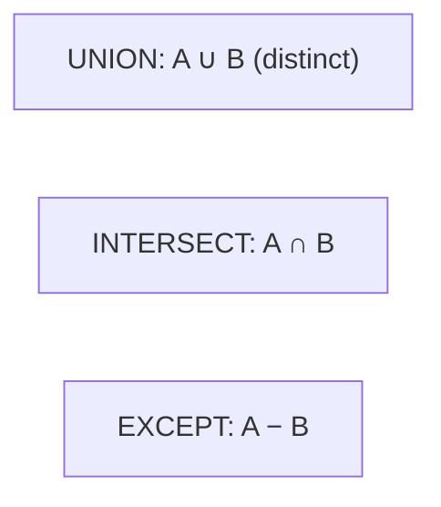

# Set Operations

## 🧠 Intuition

Set operations **stack the results of two queries vertically** and combine them as mathematical
sets: **`UNION`** (everything from both), **`INTERSECT`** (only what's in both), **`EXCEPT`** (in
the first but not the second). Where a join combines tables *side by side* on a key, set operations
combine *result sets* that have the **same columns**.

> 💡 **Analogy — combining mailing lists.** `UNION` = merge two lists, removing duplicates.
> `INTERSECT` = people on *both* lists. `EXCEPT` = people on the first list but *not* the second.

These are **standardized** — SQL Server and PostgreSQL behave identically (one tiny naming note for
`EXCEPT`).

## 📐 The three operations



| Operation | Keeps | Duplicates |
|-----------|-------|------------|
| **`UNION`** | All rows from both queries | **Removed** (distinct) |
| **`UNION ALL`** | All rows from both queries | **Kept** (faster — no dedupe) |
| **`INTERSECT`** | Rows present in **both** | Removed |
| **`EXCEPT`** | Rows in the first but **not** the second | Removed |

**Rules for all of them:**
1. Both queries must have the **same number of columns**.
2. Corresponding columns must have **compatible types**.
3. Column **names come from the first query**.
4. A single `ORDER BY` goes at the **very end** (it sorts the combined result).

## 💻 The essentials (identical on both engines)

```sql
-- UNION: cities that appear as either a customer city (dedup'd across both)
SELECT city FROM customers WHERE country = 'Germany'
UNION
SELECT city FROM customers WHERE country = 'UK';

-- UNION ALL: keep duplicates (faster — use when you KNOW there are none, or want the count)
SELECT product_id FROM order_items WHERE order_id = 1
UNION ALL
SELECT product_id FROM order_items WHERE order_id = 5;

-- INTERSECT: products ordered in BOTH order 1 and order 5
SELECT product_id FROM order_items WHERE order_id = 1
INTERSECT
SELECT product_id FROM order_items WHERE order_id = 5;

-- EXCEPT: products in order 1 but NOT in order 5
SELECT product_id FROM order_items WHERE order_id = 1
EXCEPT
SELECT product_id FROM order_items WHERE order_id = 5;

-- ORDER BY applies to the whole combined result (at the very end)
SELECT name FROM customers WHERE country = 'Germany'
UNION
SELECT name FROM customers WHERE country = 'USA'
ORDER BY name;
```

## 🟦 SQL Server vs 🐘 PostgreSQL

Essentially identical. One naming note:

| Concept | 🟦 SQL Server | 🐘 PostgreSQL |
|---------|--------------|---------------|
| `UNION` / `UNION ALL` | ✅ | ✅ |
| `INTERSECT` / `INTERSECT ALL` | `INTERSECT` (no `ALL`) | `INTERSECT` **and** `INTERSECT ALL` |
| `EXCEPT` / `EXCEPT ALL` | `EXCEPT` (no `ALL`) | `EXCEPT` **and** `EXCEPT ALL` |
| Synonym for `EXCEPT` | — | — (Oracle calls it `MINUS`; neither of ours does) |

> 🐘 PostgreSQL supports the `ALL` variant of `INTERSECT`/`EXCEPT` (which keep duplicate
> multiplicities); 🟦 SQL Server only has the distinct forms. For most work the distinct forms are
> what you want anyway.

## ⚡ Under the Hood / Performance

- **`UNION` deduplicates** — it must sort or hash the combined result to remove duplicates, which
  costs time. **`UNION ALL` skips that**, so it's faster.
- **Rule:** if you *know* the two result sets can't overlap (or you want every row), use
  **`UNION ALL`**. Only use plain `UNION` when you actually need duplicate removal.
- `INTERSECT`/`EXCEPT` also dedupe; they're handy but can sometimes be written as `EXISTS`/`NOT
  EXISTS` joins that the optimizer handles better on large tables — measure if it's hot.

## ⚖️ Set operation vs JOIN vs OR

- **Set operation** when you're combining *rows with the same shape* from different queries
  (different filters, different tables with matching columns).
- **JOIN** when you need columns from *multiple* tables side by side.
- A `UNION` of the same table with different `WHERE`s can often be a single query with `OR` or `IN`
  — simpler. Reach for `UNION` when the branches are genuinely different (different tables, different
  computed columns).

## 🚫 Common mistakes

```sql
-- ❌ Mismatched column counts
SELECT name, city FROM customers
UNION
SELECT name FROM employees;          -- ERROR: 2 columns vs 1

-- ❌ Using UNION (with dedupe) when UNION ALL would do → needless sort/hash
SELECT product_id FROM order_items WHERE order_id = 1
UNION
SELECT product_id FROM order_items WHERE order_id = 2;   -- if you want a count, dedupe is wrong AND slow
-- ✅ UNION ALL when duplicates are fine/wanted

-- ❌ Putting ORDER BY on the first query
SELECT city FROM customers ORDER BY city   -- ERROR / ignored
UNION SELECT city FROM suppliers;
-- ✅ one ORDER BY at the very end
SELECT city FROM customers
UNION SELECT city FROM suppliers
ORDER BY city;
```

## 🌍 Real-World Use

- **Combining sources:** active users `UNION` archived users into one list.
- **Reconciliation:** `EXCEPT` to find records in system A missing from system B (data migration
  validation).
- **Common membership:** `INTERSECT` to find customers who bought *both* product X and product Y.
- **Reporting unions:** stack "this year" and "last year" summaries with a literal label column.

## 🎯 Practice (with full solutions)

### 1. Combine two filtered lists — `Easy`
**Task:** A distinct list of cities where customers from Germany *or* the UK are located.
**Solution:**
```sql
SELECT city FROM customers WHERE country = 'Germany'
UNION
SELECT city FROM customers WHERE country = 'UK'
ORDER BY city;
```
**Why it works:** `UNION` merges both filtered lists and removes duplicate cities. *(Note: this
particular case could also be `WHERE country IN ('Germany','UK')` — `UNION` shines when the branches
differ more.)*

### 2. Products in one order but not another — `Medium`
**Task:** Product IDs that appear in order 1 but not in order 5.
**Solution:**
```sql
SELECT product_id FROM order_items WHERE order_id = 1
EXCEPT
SELECT product_id FROM order_items WHERE order_id = 5;
```
**Why it works:** `EXCEPT` keeps rows from the first set that don't appear in the second — set
subtraction.

### 3. Bought both products — `Medium`
**Task:** Customers who have ordered **both** product 1 (Coffee) and product 5 (USB Cable).
**Solution:**
```sql
SELECT o.customer_id FROM orders o JOIN order_items oi ON oi.order_id = o.order_id
WHERE oi.product_id = 1
INTERSECT
SELECT o.customer_id FROM orders o JOIN order_items oi ON oi.order_id = o.order_id
WHERE oi.product_id = 5;
```
**Why it works:** each `SELECT` produces the set of customers who bought one product; `INTERSECT`
keeps only customers present in *both* sets.

## ✅ Key Takeaways

- Set operations stack same-shaped result sets: **`UNION`** (both, distinct), **`UNION ALL`** (both,
  with duplicates — **faster**), **`INTERSECT`** (in both), **`EXCEPT`** (in first not second).
- Both queries need the **same column count and compatible types**; names come from the first;
  **`ORDER BY` goes at the end**.
- Use **`UNION ALL`** unless you specifically need duplicate removal.
- 🐘 adds `INTERSECT ALL`/`EXCEPT ALL`; 🟦 has only the distinct forms.

**Self-check:**
1. What's the difference between `UNION` and `UNION ALL`, and which is faster?
2. What three rules must both queries in a set operation satisfy?
3. How would you find rows in result A that are missing from result B?

---
◀ Prev: [Subqueries](05.Subqueries.md) · ▲ [Module index](README.md) · ▶ Next: [Built-in Functions](07.Built-in-Functions.md)
