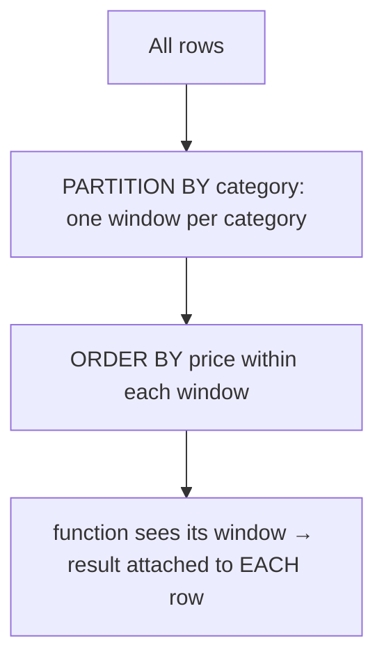

# Window Functions

> The feature that turns intermediate SQL into expert SQL. Beautifully **standardized** — SQL Server
> and PostgreSQL agree on essentially all of it.

## 🧠 Intuition

A window function does a calculation **across a set of rows related to the current row**, but —
unlike `GROUP BY` — it **keeps every row** in the output. You can show each product's price *next to*
its category average, rank rows within groups, compute running totals, or compare a row to the one
before it — all without collapsing your result.

> 💡 **Analogy — a sliding window on a moving train.** As you look at each row (each seat), the
> "window" shows you a frame of nearby rows (the whole carriage, or just the seats before you). You
> can compute something about that frame ("average ticket price in this carriage," "my position in
> line") and attach it to the current row — without removing any passengers.

The signature feature is the **`OVER (...)`** clause: `<function>() OVER (PARTITION BY ... ORDER BY
...)`.

## 🎯 The Problem

```sql
-- ❌ "Show each product with its category's average price."
-- GROUP BY collapses rows — you lose the individual products:
SELECT category_id, AVG(unit_price) FROM products GROUP BY category_id;   -- one row per category, products gone

-- A correlated subquery works but is clunky and re-runs per row:
SELECT name, unit_price,
       (SELECT AVG(unit_price) FROM products p2 WHERE p2.category_id = p.category_id) AS cat_avg
FROM products p;
```

Window functions do this cleanly in **one pass**, keeping every row.

## 📐 The `OVER` clause

```sql
<function>() OVER (
    PARTITION BY <cols>    -- split rows into groups (like GROUP BY, but rows stay)
    ORDER BY <cols>        -- order within each partition (needed for ranking / running calcs)
    <frame>                -- optional: ROWS/RANGE BETWEEN ... (the sliding window)
)
```

- **`PARTITION BY`** — divides rows into independent groups; the function resets per partition.
  Omit it to treat the whole result as one partition.
- **`ORDER BY`** — orders rows *within* the partition. Required for ranking and running totals.
- **Frame** — for running/moving calculations, defines which rows are "in the window" relative to
  the current row (e.g. "all rows from the start up to here").



## 💻 The function families

### Aggregates as windows (keep all rows)
```sql
SELECT name, category_id, unit_price,
       AVG(unit_price) OVER (PARTITION BY category_id)              AS cat_avg,
       unit_price - AVG(unit_price) OVER (PARTITION BY category_id) AS diff_from_avg,
       SUM(unit_price) OVER ()                                       AS grand_total
FROM products;
```

### Ranking functions
```sql
SELECT name, category_id, unit_price,
       ROW_NUMBER() OVER (PARTITION BY category_id ORDER BY unit_price DESC) AS rn,    -- 1,2,3 unique
       RANK()       OVER (PARTITION BY category_id ORDER BY unit_price DESC) AS rnk,   -- ties share, gaps (1,1,3)
       DENSE_RANK() OVER (PARTITION BY category_id ORDER BY unit_price DESC) AS drnk,  -- ties share, no gaps (1,1,2)
       NTILE(4)     OVER (ORDER BY unit_price)                                AS quartile
FROM products;
```

| Function | Behavior on ties |
|----------|------------------|
| `ROW_NUMBER()` | Always unique (1,2,3,4) — arbitrary among ties |
| `RANK()` | Ties share a rank, **then skip** (1,1,3) |
| `DENSE_RANK()` | Ties share a rank, **no skip** (1,1,2) |
| `NTILE(n)` | Splits rows into n roughly-equal buckets |

### Offset functions (peek at other rows)
```sql
SELECT order_date, total,
       LAG(total)  OVER (ORDER BY order_date) AS prev_total,   -- previous row's value
       LEAD(total) OVER (ORDER BY order_date) AS next_total,   -- next row's value
       total - LAG(total) OVER (ORDER BY order_date) AS change_from_prev,
       FIRST_VALUE(total) OVER (ORDER BY order_date) AS first_total
FROM daily_sales;
```

### Running / moving totals (with a frame)
```sql
SELECT order_date, total,
       SUM(total) OVER (ORDER BY order_date
                        ROWS BETWEEN UNBOUNDED PRECEDING AND CURRENT ROW) AS running_total,
       AVG(total) OVER (ORDER BY order_date
                        ROWS BETWEEN 2 PRECEDING AND CURRENT ROW)         AS moving_avg_3
FROM daily_sales;
```

> The **frame** `ROWS BETWEEN UNBOUNDED PRECEDING AND CURRENT ROW` = "from the first row up to this
> one" → a running total. `ROWS BETWEEN 2 PRECEDING AND CURRENT ROW` = a 3-row moving window.

## 🟦 SQL Server vs 🐘 PostgreSQL

Window functions are **almost identical** across both:

| Feature | 🟦 SQL Server | 🐘 PostgreSQL |
|---------|--------------|---------------|
| `ROW_NUMBER/RANK/DENSE_RANK/NTILE` | ✅ | ✅ |
| `LAG/LEAD/FIRST_VALUE/LAST_VALUE` | ✅ | ✅ |
| Aggregate `OVER()` | ✅ | ✅ |
| `ROWS`/`RANGE` frames | ✅ | ✅ |
| `GROUPS` frame mode | ❌ | ✅ |
| Named windows (`WINDOW w AS (...)`) | ❌ | ✅ |

```sql
-- 🐘 PostgreSQL: named window reused across several functions (DRY)
SELECT name, unit_price,
       RANK()       OVER w AS rnk,
       DENSE_RANK() OVER w AS drnk
FROM products
WINDOW w AS (PARTITION BY category_id ORDER BY unit_price DESC);
-- 🟦 SQL Server: repeat the OVER (...) clause for each function
```

## ⚡ Under the Hood / Performance

- Window functions are usually computed in **one pass** with a sort (for the `ORDER BY` inside
  `OVER`), far cheaper than a correlated subquery re-running per row.
- An index matching the `PARTITION BY` + `ORDER BY` can **eliminate the sort** — a big win on large
  data. Check the [execution plan](../06-Indexing-and-Performance/04.Reading-Execution-Plans.md).
- "Top-N per group" via `ROW_NUMBER() ... WHERE rn <= 3` is the standard, efficient pattern (you
  can't put a window function directly in `WHERE` — wrap it in a CTE/subquery, below).

## 🚫 Common mistakes

```sql
-- ❌ Window function in WHERE / HAVING directly — not allowed (they run after WHERE)
SELECT name FROM products WHERE ROW_NUMBER() OVER (ORDER BY unit_price) <= 3;   -- ERROR
-- ✅ wrap in a CTE/subquery, then filter
WITH ranked AS (
    SELECT name, ROW_NUMBER() OVER (ORDER BY unit_price DESC) AS rn FROM products
)
SELECT name FROM ranked WHERE rn <= 3;

-- ❌ Forgetting ORDER BY inside OVER for ranking → meaningless/error
ROW_NUMBER() OVER (PARTITION BY category_id)   -- ranking by what?
-- ✅ ROW_NUMBER() OVER (PARTITION BY category_id ORDER BY unit_price DESC)

-- ❌ Assuming LAST_VALUE works without a full frame (default frame stops at current row)
LAST_VALUE(x) OVER (ORDER BY d)   -- returns current row, not the partition's last!
-- ✅ specify the frame
LAST_VALUE(x) OVER (ORDER BY d ROWS BETWEEN UNBOUNDED PRECEDING AND UNBOUNDED FOLLOWING)
```

## 🌍 Real-World Use

- **Top-N per group:** the 3 best-selling products per category, the latest order per customer.
- **Running totals / cumulative sums:** account balances, cumulative revenue.
- **Period-over-period:** `LAG` to compute month-over-month growth.
- **Ranking & percentiles:** leaderboards, `NTILE` for quartiles/deciles.
- **Deduplication:** `ROW_NUMBER()` partitioned by the dup key, keep `rn = 1`.

## 🎯 Practice (with full solutions)

### 1. Rank products within their category — `Easy`
**Task:** For each product, show its price rank (1 = most expensive) **within its category**.
**Solution:**
```sql
SELECT name, category_id, unit_price,
       DENSE_RANK() OVER (PARTITION BY category_id ORDER BY unit_price DESC) AS price_rank
FROM products;
```
**Why it works:** `PARTITION BY category_id` ranks separately per category; `DENSE_RANK` handles
ties without gaps.

### 2. Top product per category — `Medium`
**Task:** The single most expensive product in each category.
**Solution:**
```sql
WITH ranked AS (
    SELECT name, category_id, unit_price,
           ROW_NUMBER() OVER (PARTITION BY category_id ORDER BY unit_price DESC) AS rn
    FROM products
)
SELECT name, category_id, unit_price FROM ranked WHERE rn = 1;
```
**Why it works:** number rows per category by price, then keep only `rn = 1`. The standard,
index-friendly "top-N per group" pattern — and you can't filter on the window function without the
CTE wrapper.

### 3. Running total of order values — `Medium`
**Task:** For each order (ordered by date), show the cumulative total spent across all orders so
far. (Compute each order's value from its items.)
**Solution:**
```sql
WITH order_totals AS (
    SELECT o.order_id, o.order_date, SUM(oi.quantity * oi.unit_price) AS order_value
    FROM orders o JOIN order_items oi ON oi.order_id = o.order_id
    GROUP BY o.order_id, o.order_date
)
SELECT order_id, order_date, order_value,
       SUM(order_value) OVER (ORDER BY order_date, order_id
                              ROWS BETWEEN UNBOUNDED PRECEDING AND CURRENT ROW) AS running_total
FROM order_totals
ORDER BY order_date, order_id;
```
**Why it works:** the CTE collapses items into per-order totals; the window `SUM ... ROWS UNBOUNDED
PRECEDING` accumulates them in date order — a true running total, every order row preserved.

## ✅ Key Takeaways

- Window functions compute across related rows **without collapsing them** — `<fn>() OVER
  (PARTITION BY ... ORDER BY ... <frame>)`.
- Families: **aggregates** (`AVG/SUM OVER`), **ranking** (`ROW_NUMBER/RANK/DENSE_RANK/NTILE`),
  **offset** (`LAG/LEAD/FIRST_VALUE`), **running/moving** (with a `ROWS` frame).
- You **can't filter on a window function in `WHERE`** — wrap it in a CTE/subquery (the top-N-per-
  group pattern).
- Nearly identical across engines; 🐘 adds named windows and the `GROUPS` frame.
- An index matching `PARTITION BY`+`ORDER BY` can remove the sort.

**Self-check:**
1. How does a window function differ from `GROUP BY`?
2. What's the difference between `ROW_NUMBER`, `RANK`, and `DENSE_RANK` on ties?
3. Why must you wrap a window function in a CTE to filter on its result?

---
◀ Prev: [Module index](README.md) · ▲ [Module index](README.md) · ▶ Next: [CTEs & Recursion](02.CTEs-and-Recursion.md)
