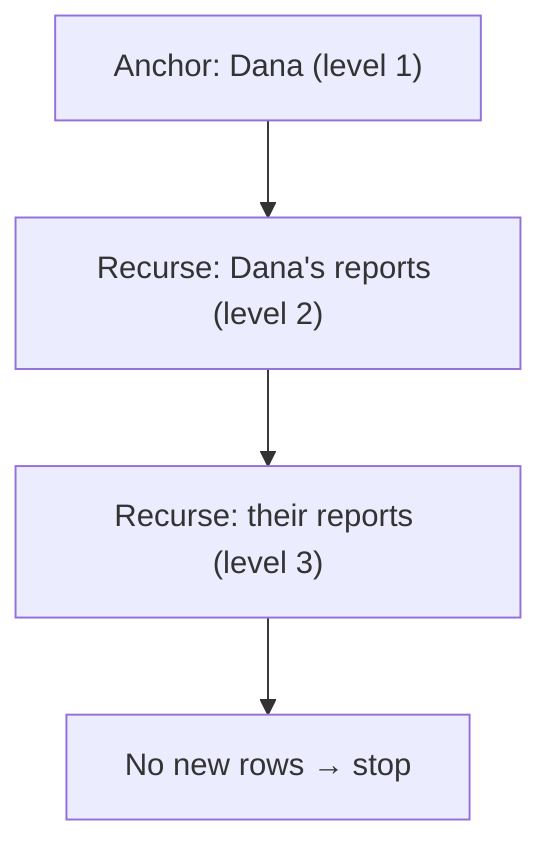

# CTEs & Recursion

## 🧠 Intuition

A **Common Table Expression (CTE)** is a named, temporary result set defined with `WITH` at the top
of a query — think of it as a "query variable" you can reference like a table. CTEs make complex
queries **readable** by breaking them into named steps instead of nesting subqueries five levels
deep. And a special form — the **recursive CTE** — can walk hierarchies and graphs (org charts,
category trees, bill-of-materials) that no flat query can.

> 💡 **Analogy — naming the steps of a recipe.** Instead of one giant run-on instruction, you write
> "1. Make the dough. 2. Make the sauce. 3. Combine." Each named step (CTE) is clear and can refer
> to the previous ones. A recursive CTE is "keep folding until done" — it repeats a step on its own
> output.

CTEs are **standardized** — SQL Server and PostgreSQL agree (one keyword difference for recursion).

## 🎯 The Problem

```sql
-- ❌ Deeply nested subqueries — correct but unreadable
SELECT * FROM (
    SELECT category_id, AVG(unit_price) AS avg_price FROM (
        SELECT * FROM products WHERE units_in_stock > 0
    ) AS in_stock GROUP BY category_id
) AS cat_avgs WHERE avg_price > 5;
```

The logic is buried in nesting. A CTE flattens it into readable steps. And for **hierarchies**
("all reports under this manager, at any depth"), a plain query simply *can't* do it — you'd need an
unknown number of self-joins.

## 💻 Basic CTEs (identical on both engines)

```sql
-- One named step, then use it
WITH in_stock AS (
    SELECT * FROM products WHERE units_in_stock > 0
)
SELECT category_id, AVG(unit_price) AS avg_price
FROM in_stock
GROUP BY category_id
HAVING AVG(unit_price) > 5;

-- Multiple CTEs, chained (each can reference earlier ones)
WITH order_totals AS (
    SELECT order_id, SUM(quantity * unit_price) AS total
    FROM order_items GROUP BY order_id
),
big_orders AS (
    SELECT order_id, total FROM order_totals WHERE total > 50
)
SELECT o.order_id, c.name, b.total
FROM big_orders b
JOIN orders o    ON o.order_id = b.order_id
JOIN customers c ON c.customer_id = o.customer_id;
```

CTEs read top-to-bottom like a pipeline — far clearer than equivalent nested subqueries, and you can
reuse a CTE multiple times in the same query.

## 💻 Recursive CTEs — walking hierarchies

A recursive CTE has two parts joined by `UNION ALL`:
1. **Anchor** — the starting row(s).
2. **Recursive member** — references the CTE itself to fetch the *next* level, repeating until no
   new rows are produced.

```sql
-- All employees in the management chain under Dana Director (employee_id = 1), at any depth
-- 🐘 PostgreSQL — note the RECURSIVE keyword
WITH RECURSIVE org_chart AS (
    -- Anchor: the top manager
    SELECT employee_id, name, manager_id, 1 AS level
    FROM employees
    WHERE employee_id = 1

    UNION ALL

    -- Recursive: everyone whose manager is already in the result
    SELECT e.employee_id, e.name, e.manager_id, oc.level + 1
    FROM employees e
    JOIN org_chart oc ON e.manager_id = oc.employee_id
)
SELECT level, name FROM org_chart ORDER BY level, name;
```

```sql
-- 🟦 SQL Server — same query, but NO "RECURSIVE" keyword (it's implicit)
WITH org_chart AS (
    SELECT employee_id, name, manager_id, 1 AS level
    FROM employees WHERE employee_id = 1
    UNION ALL
    SELECT e.employee_id, e.name, e.manager_id, oc.level + 1
    FROM employees e JOIN org_chart oc ON e.manager_id = oc.employee_id
)
SELECT level, name FROM org_chart ORDER BY level, name;
```



## 🟦 SQL Server vs 🐘 PostgreSQL

| Concept | 🟦 SQL Server | 🐘 PostgreSQL |
|---------|--------------|---------------|
| Basic CTE (`WITH x AS (...)`) | ✅ | ✅ |
| Recursive CTE | `WITH x AS (...)` *(no keyword)* | `WITH RECURSIVE x AS (...)` *(keyword required)* |
| Recursion depth guard | `OPTION (MAXRECURSION n)` (default 100) | no fixed default; `LIMIT` or a depth column |
| Writable CTE (`INSERT/UPDATE` inside `WITH`) | ❌ | ✅ (data-modifying CTEs) |
| `MATERIALIZED` / `NOT MATERIALIZED` hint | ❌ | ✅ |

> The big practical difference: **🐘 requires the `RECURSIVE` keyword; 🟦 does not** (and would error
> if you wrote it). Also, 🟦 caps recursion at **100 levels by default** — raise it with
> `OPTION (MAXRECURSION 1000)` (or `0` for unlimited, carefully).

## ⚡ Under the Hood / Performance

- A **non-recursive CTE is usually just a named subquery** — the optimizer often inlines it (no
  performance penalty vs writing it inline). 🐘 may *materialize* a CTE (compute once, reuse); you
  can force or prevent this with `MATERIALIZED`/`NOT MATERIALIZED`.
- **Recursive CTEs** can be expensive on deep/wide hierarchies — index the join column
  (`manager_id` here). Always have a **termination guarantee** (the recursion must eventually
  produce no new rows) or you'll hit the recursion cap / run forever.
- A CTE is **not** automatically an optimization fence or a temp table — don't assume it's cached
  unless materialized.

## 🚫 Common mistakes

```sql
-- ❌ 🐘: forgetting RECURSIVE on a recursive CTE
WITH org_chart AS (... self-reference ...)    -- ERROR on PostgreSQL
-- ✅ WITH RECURSIVE org_chart AS (...)

-- ❌ 🟦: hitting MAXRECURSION on a deep hierarchy
-- "The maximum recursion 100 has been exhausted"
-- ✅ add OPTION (MAXRECURSION 1000) at the end of the statement

-- ❌ Infinite recursion (cyclic data with no guard)
-- ✅ track visited nodes / a depth column, or ensure the graph is acyclic

-- ❌ Expecting a CTE to be reusable across separate statements
WITH t AS (...) SELECT * FROM t; SELECT * FROM t;   -- second statement: t doesn't exist
-- ✅ a CTE lives only for the single statement it's attached to (use a temp table/view for reuse)
```

## 🌍 Real-World Use

- **Readability:** decompose any gnarly report into named steps — the #1 everyday use.
- **Hierarchies:** org charts, category/menu trees, threaded comments, folder structures,
  bill-of-materials explosion.
- **Graph walks:** "all dependencies of this package," "all friends-of-friends."
- **Generating sequences:** a recursive CTE can produce a numbers/dates table on the fly.

## 🎯 Practice (with full solutions)

### 1. Readable multi-step query — `Easy`
**Task:** Using CTEs, list customers whose total spend exceeds $50.
**Solution:**
```sql
WITH order_values AS (
    SELECT o.customer_id, SUM(oi.quantity * oi.unit_price) AS spend
    FROM orders o JOIN order_items oi ON oi.order_id = o.order_id
    GROUP BY o.customer_id
)
SELECT c.name, ov.spend
FROM order_values ov
JOIN customers c ON c.customer_id = ov.customer_id
WHERE ov.spend > 50
ORDER BY ov.spend DESC;
```
**Why it works:** the CTE names the "spend per customer" step; the main query reads cleanly on top
of it.

### 2. Full org chart — `Medium`
**Task:** List every employee with their depth in the hierarchy (Dana = level 1).
**Solution:** the recursive `org_chart` CTE above. On the sample data it returns Dana (1), Mike (2),
Sara (3), Tom (3).
**Why it works:** the anchor picks the root; the recursive member repeatedly attaches each
employee whose manager is already in the result, incrementing `level`, until no one new is found.

### 3. Generate a date series — `Medium`
**Task:** Produce one row per day for the first 5 days of May 2025.
**Solution:**
```sql
-- 🐘 PostgreSQL (built-in, no recursion needed)
SELECT generate_series('2025-05-01'::date, '2025-05-05'::date, INTERVAL '1 day') AS d;

-- Portable recursive CTE (works on both; 🟦 omit RECURSIVE)
WITH RECURSIVE days AS (
    SELECT CAST('2025-05-01' AS DATE) AS d
    UNION ALL
    SELECT d + INTERVAL '1 day' FROM days WHERE d < '2025-05-05'   -- 🟦: DATEADD(day,1,d)
)
SELECT d FROM days;
```
**Why it works:** 🐘 has a purpose-built `generate_series`; the portable recursive CTE builds the
sequence by adding a day each iteration until the stop condition — a handy trick when you need a
calendar table and don't have one.

## ✅ Key Takeaways

- A **CTE** (`WITH name AS (...)`) is a named, single-statement result set — it makes complex
  queries readable and lets you chain steps.
- A **recursive CTE** = anchor + `UNION ALL` + self-reference; it walks hierarchies/graphs to any
  depth.
- **🐘 requires `RECURSIVE`; 🟦 doesn't** (and 🟦 caps recursion at 100 by default —
  `OPTION (MAXRECURSION n)`).
- A CTE lives only for its statement and isn't automatically materialized — for reuse, use a temp
  table or view.
- 🐘 extras: data-modifying CTEs, `MATERIALIZED` hints, `generate_series`.

**Self-check:**
1. How does a CTE improve on deeply nested subqueries?
2. What are the two parts of a recursive CTE, and what makes it stop?
3. What's the key syntax difference for recursion between SQL Server and PostgreSQL?

---
◀ Prev: [Window Functions](01.Window-Functions.md) · ▲ [Module index](README.md) · ▶ Next: [Pivot & Crosstab](03.Pivot-and-Crosstab.md)
