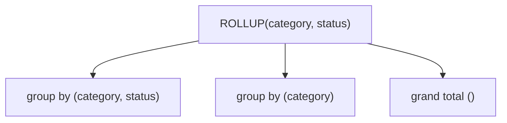

# Grouping Sets, ROLLUP & CUBE

## 🧠 Intuition

A normal `GROUP BY` gives you one level of subtotals. But reports often want **multiple levels at
once** — sales per (region, product), *plus* per region, *plus* a grand total — in a single result.
`GROUPING SETS`, `ROLLUP`, and `CUBE` are extensions to `GROUP BY` that compute several grouping
levels in one query instead of `UNION`-ing many queries together.

> 💡 **Analogy — a report with subtotals and a total row.** A sales spreadsheet shows each line,
> then a subtotal per region, then a grand total at the bottom. `ROLLUP` produces exactly that
> hierarchy of subtotals in one query — no manual `UNION` of separate aggregate queries.

These are **standardized** — SQL Server and PostgreSQL support all three identically.

## 🎯 The Problem

```sql
-- ❌ Want: totals per category, per category+status, AND a grand total.
-- Without these features you UNION three separate aggregations:
SELECT category_id, NULL AS status, SUM(...) FROM ... GROUP BY category_id
UNION ALL
SELECT category_id, status, SUM(...) FROM ... GROUP BY category_id, status
UNION ALL
SELECT NULL, NULL, SUM(...) FROM ...;     -- grand total
```

Verbose, repetitive, and the engine scans the data three times. `ROLLUP`/`GROUPING SETS` do it in
**one** pass.

## 📐 The three extensions

| Extension | Produces |
|-----------|----------|
| **`GROUPING SETS`** | Exactly the grouping combinations you list |
| **`ROLLUP(a, b)`** | Hierarchical subtotals: `(a,b)`, `(a)`, `()` — like a report drilling up |
| **`CUBE(a, b)`** | **All** combinations: `(a,b)`, `(a)`, `(b)`, `()` — every cross-tab subtotal |



## 💻 Examples (identical on both engines)

```sql
-- ROLLUP: revenue by category, then per category subtotal, then grand total
SELECT p.category_id, o.status,
       SUM(oi.quantity * oi.unit_price) AS revenue
FROM order_items oi
JOIN products p ON p.product_id = oi.product_id
JOIN orders   o ON o.order_id   = oi.order_id
GROUP BY ROLLUP (p.category_id, o.status)
ORDER BY p.category_id, o.status;
-- rows: (cat,status) detail + (cat, NULL) subtotal + (NULL, NULL) grand total

-- CUBE: every combination, including per-status-across-all-categories
SELECT p.category_id, o.status, SUM(oi.quantity * oi.unit_price) AS revenue
FROM order_items oi
JOIN products p ON p.product_id = oi.product_id
JOIN orders   o ON o.order_id   = oi.order_id
GROUP BY CUBE (p.category_id, o.status);

-- GROUPING SETS: pick exactly the levels you want (here: per category, per status, grand total — but NOT the cross)
SELECT p.category_id, o.status, SUM(oi.quantity * oi.unit_price) AS revenue
FROM order_items oi
JOIN products p ON p.product_id = oi.product_id
JOIN orders   o ON o.order_id   = oi.order_id
GROUP BY GROUPING SETS ((p.category_id), (o.status), ());
```

### Telling subtotal rows apart with GROUPING()

The subtotal rows have `NULL` in the columns that are "rolled up" — but a real `NULL` value would
look the same. The **`GROUPING()`** function distinguishes them (returns 1 for an aggregated/
rolled-up column, 0 for a real value):

```sql
SELECT
    CASE WHEN GROUPING(p.category_id) = 1 THEN 'ALL CATEGORIES' ELSE CAST(p.category_id AS VARCHAR) END AS category,
    CASE WHEN GROUPING(o.status) = 1 THEN 'ALL STATUSES' ELSE o.status END AS status,
    SUM(oi.quantity * oi.unit_price) AS revenue
FROM order_items oi
JOIN products p ON p.product_id = oi.product_id
JOIN orders   o ON o.order_id   = oi.order_id
GROUP BY ROLLUP (p.category_id, o.status);
```

## 🟦 SQL Server vs 🐘 PostgreSQL

Nearly identical — all three extensions and `GROUPING()` exist on both.

| Concept | 🟦 SQL Server | 🐘 PostgreSQL |
|---------|--------------|---------------|
| `GROUPING SETS` / `ROLLUP` / `CUBE` | ✅ (ANSI syntax) | ✅ |
| `GROUPING(col)` | ✅ | ✅ |
| Legacy `WITH ROLLUP` / `WITH CUBE` | deprecated old syntax | ❌ (use ANSI form) |
| `GROUPING_ID(...)` (bitmask of multiple cols) | ✅ | ✅ |

> Use the **ANSI form** (`GROUP BY ROLLUP (...)`) on both. 🟦's old `GROUP BY ... WITH ROLLUP`
> syntax is deprecated — avoid it.

## ⚡ Under the Hood / Performance

- These compute multiple grouping levels in **one scan** of the data — much cheaper than `UNION`-ing
  separate `GROUP BY` queries, which scan once each.
- `CUBE(a, b, c, ...)` generates **2ⁿ** grouping sets — for many columns that's a lot of subtotal
  rows. Prefer `GROUPING SETS` to compute *only* the levels you actually need.
- The engine still benefits from indexes/sorting on the grouping columns, same as a normal
  `GROUP BY`.

## 🚫 Common mistakes

```sql
-- ❌ Can't tell a "subtotal NULL" from a real data NULL
-- subtotal rows have NULL in rolled-up columns; so does genuinely-missing data
-- ✅ use GROUPING(col) to label them

-- ❌ CUBE on many columns → 2^n subtotal rows, huge result
GROUP BY CUBE (a, b, c, d, e)    -- 32 grouping sets!
-- ✅ GROUPING SETS ((a,b), (a), ()) — only what you need

-- ❌ Using 🟦's deprecated WITH ROLLUP
GROUP BY category_id WITH ROLLUP
-- ✅ GROUP BY ROLLUP (category_id)
```

## 🌍 Real-World Use

Financial and sales reports almost always want subtotals + grand totals: revenue by region with
regional subtotals and a company total; headcount by department and seniority with rollups; any
"drill-down" report. BI tools generate these, but knowing the SQL lets you build the exact report
shape server-side and feed clean numbers to the dashboard.

## 🎯 Practice (with full solutions)

### 1. Revenue with category subtotals and grand total — `Medium`
**Task:** Revenue per (category, status), plus a subtotal per category, plus a grand total — one
query.
**Solution:**
```sql
SELECT p.category_id, o.status, SUM(oi.quantity * oi.unit_price) AS revenue
FROM order_items oi
JOIN products p ON p.product_id = oi.product_id
JOIN orders   o ON o.order_id   = oi.order_id
GROUP BY ROLLUP (p.category_id, o.status)
ORDER BY p.category_id, o.status;
```
**Why it works:** `ROLLUP(category, status)` yields the detail rows, a per-category subtotal (status
= NULL), and the grand total (both NULL) — in a single pass.

### 2. Label the totals clearly — `Medium`
**Task:** Same report, but show `'ALL CATEGORIES'` / `'ALL STATUSES'` on the subtotal/total rows
instead of NULL.
**Solution:**
```sql
SELECT
    CASE WHEN GROUPING(p.category_id) = 1 THEN 'ALL CATEGORIES' ELSE CAST(p.category_id AS VARCHAR) END AS category,
    CASE WHEN GROUPING(o.status) = 1 THEN 'ALL STATUSES' ELSE o.status END AS status,
    SUM(oi.quantity * oi.unit_price) AS revenue
FROM order_items oi
JOIN products p ON p.product_id = oi.product_id
JOIN orders   o ON o.order_id   = oi.order_id
GROUP BY ROLLUP (p.category_id, o.status);
```
**Why it works:** `GROUPING(col)` returns 1 on rolled-up (subtotal/total) rows, letting you replace
the ambiguous NULL with a readable label.

## ✅ Key Takeaways

- `GROUPING SETS`/`ROLLUP`/`CUBE` extend `GROUP BY` to produce **multiple subtotal levels in one
  query** (one scan) instead of `UNION`-ing many.
- **`ROLLUP`** = hierarchical subtotals + grand total; **`CUBE`** = all combinations; **`GROUPING
  SETS`** = exactly the levels you list.
- Use **`GROUPING(col)`** to distinguish subtotal-NULL from real-NULL and label total rows.
- Prefer **`GROUPING SETS`** over `CUBE` when you don't need all 2ⁿ combinations.
- Identical on both engines via the ANSI syntax (avoid 🟦's deprecated `WITH ROLLUP`).

**Self-check:**
1. What's the difference between `ROLLUP` and `CUBE`?
2. Why do you need `GROUPING()`, and what does it return?
3. Why is one `ROLLUP` query better than three `UNION`-ed `GROUP BY` queries?

---
◀ Prev: [Conditional Logic](04.Conditional-Logic.md) · ▲ [Module index](README.md) · ▶ Next module: [03 — Modifying Data & DDL](../03-Modifying-Data-and-DDL/01.Insert-Update-Delete.md)
