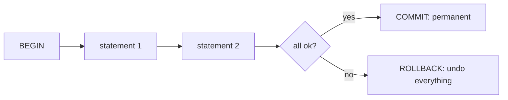

# Transactions & ACID

## 🧠 Intuition

A **transaction** groups several statements into one **all-or-nothing** unit: either every change
commits together, or none of them do. Transfer money from A to B — debit A, credit B — must be
atomic: if the credit fails after the debit, the money can't just vanish. `BEGIN` starts a
transaction, `COMMIT` makes its changes permanent, `ROLLBACK` undoes them all.

> 💡 **Analogy — a wedding ceremony.** "Do you take...?" — both must say "I do." If either backs out,
> the marriage doesn't half-happen; it doesn't happen at all. A transaction is that: every step
> succeeds together, or the whole thing is called off and nothing changed.

The guarantees a transaction provides are summarized by **ACID**.

## 📐 ACID — the four guarantees

| Letter | Property | Means |
|--------|----------|-------|
| **A** | **Atomicity** | All statements succeed, or all are rolled back — no partial state |
| **C** | **Consistency** | The transaction moves the DB from one valid state to another (constraints hold) |
| **I** | **Isolation** | Concurrent transactions don't corrupt each other (degree set by [isolation level](02.Isolation-Levels.md)) |
| **D** | **Durability** | Once committed, changes survive crashes (written to the transaction log/WAL) |



## 💻 The basics (nearly identical on both engines)

```sql
-- 🟦 SQL Server
BEGIN TRANSACTION;
    UPDATE accounts SET balance = balance - 100 WHERE id = 1;   -- debit
    UPDATE accounts SET balance = balance + 100 WHERE id = 2;   -- credit
COMMIT;                                                          -- both, or neither (with error handling)
```
```sql
-- 🐘 PostgreSQL
BEGIN;
    UPDATE accounts SET balance = balance - 100 WHERE id = 1;
    UPDATE accounts SET balance = balance + 100 WHERE id = 2;
COMMIT;
```

Pair this with [error handling](../04-Programmable-SQL/04.Error-Handling.md) so a failure triggers a
`ROLLBACK`:

```sql
-- 🐘 PostgreSQL (psql / app): rollback on error
BEGIN;
    UPDATE accounts SET balance = balance - 100 WHERE id = 1;
    -- if the next statement errors, ROLLBACK; otherwise COMMIT
    UPDATE accounts SET balance = balance + 100 WHERE id = 2;
COMMIT;   -- or ROLLBACK; on failure
```

## 📐 Autocommit — the invisible transaction

By default, **a single statement is its own transaction** (autocommit) — it commits immediately if
it succeeds. So `UPDATE products SET ...` is already atomic by itself. You only need explicit
`BEGIN`/`COMMIT` when **multiple statements must commit together**.

| | 🟦 SQL Server | 🐘 PostgreSQL |
|--|--------------|---------------|
| Default mode | Autocommit (each statement) | Autocommit (each statement) |
| Implicit transactions option | `SET IMPLICIT_TRANSACTIONS ON` (less common) | always explicit `BEGIN` to start one |
| Nested transactions | Pseudo-nested (`@@TRANCOUNT`; only outer COMMIT counts) | No true nesting — uses **savepoints** instead |

> ⚠️ **SQL Server's "nested transactions" are a trap:** an inner `COMMIT` doesn't actually commit;
> only the outermost `COMMIT` does, and any `ROLLBACK` rolls back *everything*. For partial rollback,
> use **savepoints**. 🐘 has no
> nested transactions at all — savepoints are the mechanism.

## 💻 Savepoints — partial rollback

```sql
-- Both engines: roll back part of a transaction without abandoning all of it
BEGIN;
    INSERT INTO orders (...) VALUES (...);
    SAVEPOINT after_order;                 -- 🟦: SAVE TRANSACTION after_order;
    INSERT INTO order_items (...) VALUES (...);   -- if this fails...
    ROLLBACK TO SAVEPOINT after_order;     -- 🟦: ROLLBACK TRANSACTION after_order;  -- keep the order, drop the item attempt
COMMIT;
```

| | 🟦 SQL Server | 🐘 PostgreSQL |
|--|--------------|---------------|
| Create savepoint | `SAVE TRANSACTION name` | `SAVEPOINT name` |
| Roll back to it | `ROLLBACK TRANSACTION name` | `ROLLBACK TO SAVEPOINT name` |

## ⚡ Under the Hood / Durability

- **Durability** comes from the **write-ahead log** (🟦 transaction log / 🐘 WAL): changes are written
  to the log *before* `COMMIT` returns, so even if the server crashes a moment later, the committed
  transaction can be recovered. See [Storage & Memory](../09-Architecture-and-Internals/03.Storage-and-Memory.md).
- **Longer transactions = more risk:** they hold locks longer (more blocking), keep log space, and
  (in 🐘) hold back vacuum. **Keep transactions short** — do the minimum, commit, move on.
- A transaction left open (forgotten `COMMIT`) can block other sessions and bloat the log — a common
  production incident.

## 🚫 Common mistakes

```sql
-- ❌ Forgetting to COMMIT (or ROLLBACK) → transaction stays open, holds locks, blocks others
BEGIN; UPDATE ...;   -- ...and the session sits idle. Disaster.
-- ✅ always COMMIT or ROLLBACK promptly; keep transactions short

-- ❌ Relying on SQL Server "nested" COMMIT to commit inner work (it doesn't)
BEGIN TRAN; ... BEGIN TRAN; ... COMMIT;   -- inner COMMIT is a no-op; only outer counts
-- ✅ use savepoints for partial control

-- ❌ Doing slow/external work inside a transaction (HTTP calls, user prompts)
-- → holds locks for ages. ✅ do external work OUTSIDE the transaction

-- ❌ No error handling → an error mid-transaction can leave it open (esp. 🟦)
-- ✅ TRY/CATCH + ROLLBACK (🟦) / EXCEPTION (🐘)
```

## 🌍 Real-World Use

Any operation touching multiple rows/tables that must be consistent: money transfers, order
placement (order + items + stock), inventory adjustments, double-entry bookkeeping, "create user +
profile + default settings." Transactions are the foundation that makes these safe under failure and
concurrency.

## 🎯 Practice (with full solutions)

### 1. Atomic transfer — `Easy`
**Task:** Move $100 from account 1 to account 2 atomically, rolling back if the second update fails.
**Solution:**
```sql
-- 🟦 SQL Server (with error handling)
BEGIN TRY
    BEGIN TRANSACTION;
        UPDATE accounts SET balance = balance - 100 WHERE id = 1;
        UPDATE accounts SET balance = balance + 100 WHERE id = 2;
    COMMIT;
END TRY
BEGIN CATCH
    IF @@TRANCOUNT > 0 ROLLBACK;
    THROW;
END CATCH;
```
```sql
-- 🐘 PostgreSQL (in a procedure, EXCEPTION auto-rolls-back)
BEGIN;
    UPDATE accounts SET balance = balance - 100 WHERE id = 1;
    UPDATE accounts SET balance = balance + 100 WHERE id = 2;
COMMIT;
```
**Why it works:** both updates are inside one transaction — if either fails, the rollback restores
both balances, so money is never lost or duplicated (Atomicity).

### 2. Keep part of the work — `Medium`
**Task:** Insert an order; then try to insert an item — if the item fails, keep the order but discard
the item attempt.
**Solution:**
```sql
-- 🐘 PostgreSQL
BEGIN;
    INSERT INTO orders (customer_id, order_date, status) VALUES (1, CURRENT_DATE, 'Pending');
    SAVEPOINT after_order;
    -- attempt the item; on error:
    -- ROLLBACK TO SAVEPOINT after_order;
COMMIT;
-- 🟦: SAVE TRANSACTION after_order; ... ROLLBACK TRANSACTION after_order;
```
**Why it works:** the savepoint marks a point you can return to; rolling back to it undoes only the
item attempt while preserving the committed-so-far order — partial control within one transaction.

## ✅ Key Takeaways

- A **transaction** = all-or-nothing: `BEGIN` → statements → `COMMIT` (permanent) or `ROLLBACK`
  (undo).
- **ACID** = **A**tomicity, **C**onsistency, **I**solation, **D**urability.
- Single statements **autocommit**; use explicit transactions when **multiple statements must commit
  together**.
- **Savepoints** allow partial rollback; 🟦's "nested transactions" are a trap (only the outer commit
  counts) and 🐘 has no nesting — both rely on savepoints.
- **Keep transactions short**; pair with error handling; never do slow/external work inside one.

**Self-check:**
1. What does each letter of ACID guarantee?
2. When do you need an explicit transaction vs relying on autocommit?
3. Why are SQL Server "nested transactions" misleading, and what do you use instead?

---
◀ Prev: [Module index](README.md) · ▲ [Module index](README.md) · ▶ Next: [Isolation Levels](02.Isolation-Levels.md)
