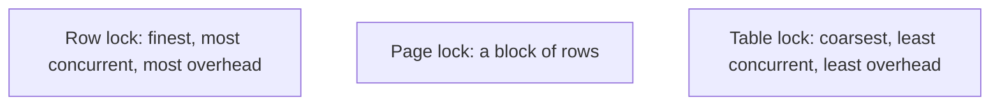

# Locking, Blocking & Deadlocks

## 🧠 Intuition

To keep concurrent transactions from corrupting each other, the database uses **locks** — a
transaction "claims" a row/page/table before modifying it, so others wait. **Blocking** is the
normal, healthy result: transaction B waits for A to finish. **Deadlock** is the pathological case:
A holds a lock B wants, *and* B holds a lock A wants — neither can proceed, so the database picks a
**victim** and kills it.

> 💡 **Analogy — a single-lane bridge.** A lock is one car claiming the bridge; others wait
> (blocking) — fine, traffic flows. A deadlock is two cars entering from opposite ends and meeting
> in the middle: neither can back up because each blocks the other. Someone has to reverse (the
> victim) for traffic to move.

## 📐 Lock types & granularity

| Lock mode | Meaning |
|-----------|---------|
| **Shared (S)** | For reading — multiple readers can share it (in lock-based mode) |
| **Exclusive (X)** | For writing — only one holder; blocks everyone else |
| **Update (U)** | 🟦: an intermediate lock to prevent a deadlock pattern during updates |

**Granularity** — what gets locked — trades concurrency for overhead:



🟦 may **escalate** many row locks into a single table lock to save memory (lock escalation) — which
can suddenly block a whole table. 🐘 uses **row-level locks** for writes and, thanks to MVCC, doesn't
take read locks for normal `SELECT`s at all (readers don't block writers).

## 🎯 The Problem — a deadlock

```sql
-- Transaction A                          -- Transaction B (concurrent)
BEGIN;                                    BEGIN;
UPDATE accounts SET ... WHERE id = 1;     UPDATE accounts SET ... WHERE id = 2;   -- each locks a different row
UPDATE accounts SET ... WHERE id = 2;     UPDATE accounts SET ... WHERE id = 1;   -- now each waits for the other's row
-- A waits for B's lock on row 2; B waits for A's lock on row 1 → DEADLOCK
```

The engine detects the cycle, kills one transaction (`Transaction (Process ID ...) was deadlocked`
on 🟦 / `deadlock detected` on 🐘), and the **application must retry** the victim.

## 📐 Blocking vs deadlock

| | Blocking | Deadlock |
|--|----------|----------|
| What | B waits for A to release a lock | A and B wait for **each other** (cycle) |
| Resolves itself? | Yes — when A commits/rolls back | No — engine kills a **victim** |
| Healthy? | Normal under concurrency | A bug pattern to fix/retry |
| Fix | Keep transactions short; index the predicate | Consistent lock order; retry the victim |

## 💻 Diagnosing & controlling locks

```sql
-- 🟦 SQL Server: see who's blocking whom
SELECT blocking_session_id, session_id, wait_type, wait_time, wait_resource
FROM sys.dm_exec_requests WHERE blocking_session_id <> 0;

-- 🐘 PostgreSQL: see blocked vs blocking
SELECT * FROM pg_locks pl JOIN pg_stat_activity sa ON pl.pid = sa.pid WHERE NOT granted;
```

### Explicit locking (when you need it)

```sql
-- Lock rows you intend to update, to prevent lost updates / coordinate (pessimistic)
-- 🟦 SQL Server
SELECT * FROM accounts WITH (UPDLOCK, ROWLOCK) WHERE id = 1;
-- 🐘 PostgreSQL
SELECT * FROM accounts WHERE id = 1 FOR UPDATE;     -- locks the row until commit
```

`SELECT ... FOR UPDATE` (🐘) / `WITH (UPDLOCK)` (🟦) is **pessimistic locking** — covered in
[Optimistic vs Pessimistic](05.Optimistic-vs-Pessimistic.md).

## ⚖️ Preventing deadlocks

1. **Access objects in a consistent order.** If every transaction locks accounts in ascending `id`
   order, the cyclic wait can't form. (The deadlock above happens because A goes 1→2 and B goes
   2→1.)
2. **Keep transactions short.** Less time holding locks = smaller collision window.
3. **Use the right isolation level / snapshot reads.** Non-blocking reads (MVCC / `READ_COMMITTED_
   SNAPSHOT`) remove a huge class of reader/writer blocking.
4. **Index your predicates.** An unindexed `WHERE` scans and locks far more than necessary,
   widening the blast radius.
5. **Always retry the deadlock victim** in application code — deadlocks can't be fully eliminated, so
   handle them gracefully.

## 🚫 Common mistakes

```sql
-- ❌ Inconsistent lock ordering across code paths → deadlocks
-- Path 1 updates orders then customers; Path 2 updates customers then orders. ✅ pick one order everywhere.

-- ❌ Long transactions holding locks while doing slow work (HTTP calls, user input)
-- ✅ do external/slow work outside the transaction; keep the locked section tiny

-- ❌ Unindexed UPDATE/DELETE WHERE → scans and locks the whole table → mass blocking
-- ✅ index the filter column

-- ❌ No deadlock retry → users see random failures
-- ✅ catch the deadlock error (🟦 error 1205 / 🐘 SQLSTATE 40P01) and retry the transaction
```

## 🌍 Real-World Use

Blocking and deadlocks are everyday production concerns on busy OLTP systems. The senior skills:
reading the blocking chain (`sys.dm_exec_requests` / `pg_locks`), spotting the inconsistent
lock-order that causes a recurring deadlock, shortening hot transactions, and implementing
deadlock-retry. Snapshot/MVCC reads eliminate most *reader* blocking, leaving you to manage
*writer* contention.

## 🎯 Practice (with full solutions)

### 1. Fix a recurring deadlock — `Medium`
**Task:** Two code paths both update `orders` and `customers`, but in opposite order, and deadlock
under load. Fix it.
**Solution:** enforce a **consistent lock order** in both paths — e.g. always update `customers`
*before* `orders` (or always lock rows in ascending PK order):
```sql
-- Both paths now do customers first, then orders:
BEGIN;
    UPDATE customers SET ... WHERE customer_id = @c;
    UPDATE orders    SET ... WHERE order_id    = @o;
COMMIT;
```
**Why it works:** a deadlock cycle requires two transactions to acquire the same locks in *opposite*
order. Force a single global order and the cycle is impossible — the second transaction simply
blocks (healthy) instead of deadlocking.

### 2. Reduce blocking on a hot read — `Medium`
**Task:** A reporting `SELECT` is blocked by ongoing writes on SQL Server. Reduce the blocking
without dirty reads.
**Solution:**
```sql
-- Enable optimistic, versioned reads so readers don't take shared locks:
ALTER DATABASE MyDb SET READ_COMMITTED_SNAPSHOT ON;
-- The report now reads a consistent committed snapshot via row versions — no blocking, no dirty reads.
-- (PostgreSQL already does this by default with MVCC.)
```
**Why it works:** under `READ_COMMITTED_SNAPSHOT`, readers use row versions instead of shared locks,
so the writer's exclusive locks no longer block the report — the same mechanism 🐘's MVCC provides
out of the box.

## ✅ Key Takeaways

- **Locks** coordinate concurrent writes; **blocking** (B waits for A) is normal; **deadlock** (A↔B
  cycle) makes the engine kill a **victim**.
- Lock **granularity** trades concurrency vs overhead; 🟦 can **escalate** to table locks; 🐘 uses
  row-level write locks and (via MVCC) **no read locks** for plain `SELECT`.
- Prevent deadlocks: **consistent lock order**, **short transactions**, **indexed predicates**,
  **snapshot reads**, and **always retry the victim**.
- Diagnose with `sys.dm_exec_requests` (🟦) / `pg_locks` + `pg_stat_activity` (🐘).
- The proper fix for reader/writer blocking on 🟦 is **snapshot isolation**, not dirty reads.

**Self-check:**
1. What's the difference between blocking and deadlock?
2. What's the single most effective way to prevent deadlocks?
3. How does PostgreSQL's MVCC reduce locking compared to default SQL Server?

---
◀ Prev: [Isolation Levels](02.Isolation-Levels.md) · ▲ [Module index](README.md) · ▶ Next: [MVCC vs Lock-Based](04.MVCC-vs-Lock-Based.md)
