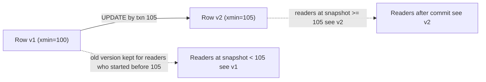

# MVCC vs Lock-Based Concurrency

> The deepest architectural difference between the two engines — and a favorite interview topic.

## 🧠 Intuition

How does a database let many transactions read and write at once without chaos? Two philosophies:

- **Lock-based (classic SQL Server default):** a writer locks rows; readers wanting consistency take
  shared locks and may **wait** for the writer. Correctness via *exclusion*.
- **MVCC — Multi-Version Concurrency Control (PostgreSQL, and SQL Server's snapshot modes):** every
  update creates a **new version** of the row, keeping the old one around. Readers see the version
  that was committed when their transaction/statement started — so **readers never block writers and
  writers never block readers**. Correctness via *versioning*.

> 💡 **Analogy — editing a shared document.** Lock-based is Google Docs with "only one editor at a
> time": others wait to even read while you edit. MVCC is Git: you edit your own copy (a new
> version); everyone else keeps reading the last committed version until you commit. No one waits to
> read.

## 📐 How MVCC works (PostgreSQL)

When you `UPDATE` a row in PostgreSQL, it doesn't overwrite in place — it writes a **new row
version** and marks the old one as expired (via hidden system columns `xmin`/`xmax` recording which
transaction created/deleted each version):



- A transaction sees a **consistent snapshot**: the set of row versions committed as of its start.
- A reader scanning the table **skips** versions it shouldn't see — it never waits for a writer.
- Two concurrent writers to the *same* row still conflict (one waits/errors) — MVCC removes
  reader/writer contention, not writer/writer.

### The cost: dead tuples and VACUUM

Old, no-longer-visible row versions ("dead tuples") accumulate. PostgreSQL's **`VACUUM`** (usually
**autovacuum**, running automatically) reclaims that space and prevents **table bloat**. This is the
price of MVCC — and a key 🐘 operational concern (see
[Maintenance](../11-Operations/02.Maintenance.md)).

## 📐 How lock-based works (classic SQL Server)

By default, SQL Server uses **pessimistic locking** for `READ COMMITTED`: a writer takes exclusive
locks; a reader takes shared locks and **blocks** until the writer commits. No old versions are kept
(in pure lock mode), so there's no bloat — but readers and writers contend.

SQL Server can switch to a **version-based (MVCC-like)** approach by enabling
**`READ_COMMITTED_SNAPSHOT`** or using `SNAPSHOT` isolation — then it keeps row versions in
**tempdb** and behaves much like PostgreSQL (readers don't block writers). Many production SQL Server
databases enable this.

## 🟦 SQL Server vs 🐘 PostgreSQL — side by side

| Aspect | 🟦 SQL Server (default) | 🟦 with snapshot | 🐘 PostgreSQL |
|--------|------------------------|------------------|---------------|
| Concurrency model | Lock-based | Row-versioning (MVCC-like) | **MVCC (always)** |
| Readers block writers? | **Yes** (shared locks) | No | **No** |
| Writers block readers? | **Yes** | No | **No** |
| Writer vs writer (same row) | Blocks | Blocks | Blocks (or serialization error) |
| Where versions live | n/a | **tempdb** | In the table (then vacuumed) |
| Cleanup needed | n/a | tempdb space | **VACUUM / autovacuum** (bloat) |
| `UPDATE` does | In-place (mostly) | In-place + version | **New row version** |

> **The one-liner for interviews:** *"PostgreSQL is MVCC by default — readers never block writers —
> at the cost of needing VACUUM to clean up old row versions. SQL Server is lock-based by default —
> readers can block writers — unless you enable `READ_COMMITTED_SNAPSHOT`, which gives it MVCC-like
> behavior using version storage in tempdb."*

## ⚖️ Implications you'll feel

- **Read-heavy + write-heavy at once:** 🐘 (and snapshot-🟦) shine — reports don't block the OLTP write
  path. Default lock-based 🟦 suffers reader/writer blocking (hence the `NOLOCK` temptation, and the
  better fix of enabling snapshot).
- **Bloat (🐘):** heavy `UPDATE`/`DELETE` churn creates dead tuples; if autovacuum can't keep up,
  tables and indexes bloat, queries slow, disk grows. Monitoring/tuning autovacuum is a core 🐘 skill.
- **Long transactions (🐘):** a long-running transaction holds back vacuum (old versions can't be
  cleaned while any transaction might still need them) → bloat. **Keep transactions short** is doubly
  important on PostgreSQL.
- **tempdb (🟦 snapshot):** version store lives in tempdb — size and monitor it when using snapshot
  isolation.

## 🚫 Common mistakes

```sql
-- ❌ 🐘: leaving a transaction open for a long time → blocks autovacuum → bloat
-- ✅ commit promptly; monitor with pg_stat_activity for long-idle-in-transaction sessions

-- ❌ 🟦: using NOLOCK to "avoid blocking" instead of enabling READ_COMMITTED_SNAPSHOT
-- ✅ ALTER DATABASE ... SET READ_COMMITTED_SNAPSHOT ON; (MVCC-like, no dirty reads)

-- ❌ Assuming MVCC means writers never conflict (they do — same-row writers still block/abort)
-- ✅ MVCC removes READER/WRITER contention, not writer/writer

-- ❌ Ignoring autovacuum on a high-churn 🐘 table → silent bloat and slowdown
-- ✅ tune autovacuum thresholds; watch dead-tuple counts
```

## 🌍 Real-World Use

Understanding this difference explains a lot of real behavior: why a PostgreSQL report doesn't freeze
the app under load, why a PostgreSQL table mysteriously grew to 3× its data size (bloat from
un-vacuumed dead tuples), why a SQL Server reporting query hangs behind a big update (lock-based
default), and why enabling `READ_COMMITTED_SNAPSHOT` on SQL Server often dramatically improves
concurrency. It's foundational for diagnosing concurrency issues on either engine.

## 🎯 Practice (with full solutions)

### 1. Explain the behavior — `Easy`
**Task:** On default SQL Server, a long `UPDATE` on `orders` makes a reporting `SELECT * FROM orders`
hang. On PostgreSQL the same `SELECT` returns instantly. Why?
**Solution:** Default SQL Server is **lock-based** — the `UPDATE` holds exclusive locks and the
`SELECT` waits for shared locks (blocking). PostgreSQL is **MVCC** — the `SELECT` reads the last
committed **row versions** and never waits for the writer. Enabling `READ_COMMITTED_SNAPSHOT` on SQL
Server would make it behave like PostgreSQL here.
**Why it matters:** this is *the* practical consequence of the two models, and the reasoning behind
turning on snapshot isolation.

### 2. Diagnose PostgreSQL bloat — `Medium`
**Task:** A high-update PostgreSQL table has grown far larger than its live data and queries are
slowing. What's happening and what do you check?
**Solution:** MVCC keeps old row versions on every `UPDATE`/`DELETE`; if **autovacuum** isn't keeping
up (or a long-running transaction is blocking it), **dead tuples** accumulate as **bloat**. Check:
```sql
SELECT relname, n_live_tup, n_dead_tup, last_autovacuum
FROM pg_stat_user_tables ORDER BY n_dead_tup DESC;
-- look for long "idle in transaction" sessions blocking vacuum:
SELECT pid, state, xact_start, query FROM pg_stat_activity WHERE state = 'idle in transaction';
```
Fix by tuning autovacuum, ending long transactions, and running `VACUUM (FULL)` if severe.
**Why it works:** the dead-tuple count and autovacuum timing directly reveal MVCC bloat — a problem
that simply doesn't exist in lock-based mode but is the trade-off for MVCC's non-blocking reads.

## ✅ Key Takeaways

- **MVCC** (🐘 default, 🟦 snapshot modes) keeps **multiple row versions** so **readers never block
  writers** and vice versa — at the cost of cleaning up old versions.
- **Lock-based** (🟦 default) uses locks for `READ COMMITTED`, so **readers can block writers** — fix
  with **`READ_COMMITTED_SNAPSHOT`** to get MVCC-like behavior (versions in **tempdb**).
- 🐘's `UPDATE` writes a **new version**; dead versions are reclaimed by **VACUUM/autovacuum** —
  un-tuned, this causes **bloat**, worsened by **long transactions**.
- MVCC removes **reader/writer** contention, not **writer/writer**.
- The model explains real-world concurrency behavior on both engines.

**Self-check:**
1. In MVCC, why don't readers block writers?
2. What is VACUUM for, and why does PostgreSQL need it but lock-based SQL Server doesn't?
3. How does enabling `READ_COMMITTED_SNAPSHOT` change SQL Server's behavior?

---
◀ Prev: [Locking, Blocking, Deadlocks](03.Locking-Blocking-Deadlocks.md) · ▲ [Module index](README.md) · ▶ Next: [Optimistic vs Pessimistic](05.Optimistic-vs-Pessimistic.md)
