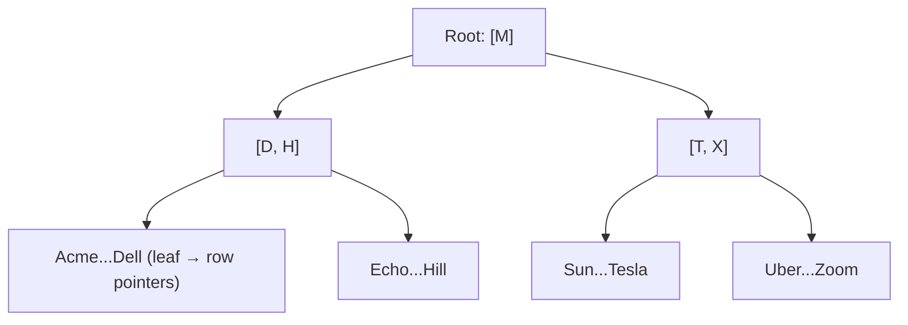
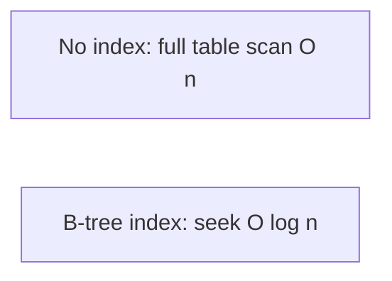

# How Indexes Work

## 🧠 Intuition

An **index** is a sorted lookup structure the database keeps *alongside* a table so it can find rows
**without scanning the whole thing**. Without an index, finding "the customer named Acme" means
reading every row (a **table scan**, O(n)). With an index on `name`, the database jumps straight to
it (an **index seek**, O(log n)). Indexes are the single biggest lever on query performance.

> 💡 **Analogy — the index at the back of a book.** To find every mention of "transactions," you
> don't read all 500 pages — you flip to the index, find "transactions → pp. 142, 305," and jump
> there. A database index is exactly that: a sorted list of values pointing to where the rows live.

## 📐 The B-tree — the workhorse structure

Most indexes are **B-trees** (balanced trees): a shallow, sorted tree where every leaf is the same
distance from the root. Searching walks down a few levels, halving the candidates at each step —
hence O(log n).



- Even a billion-row table is only a handful of levels deep — a seek touches just a few pages.
- Because the leaves are **sorted**, a B-tree also accelerates **range queries** (`BETWEEN`, `>`,
  `ORDER BY`) and **prefix `LIKE`** (`'Ac%'`), not just equality.

## 📐 What an index speeds up — and what it costs

**Speeds up:** `WHERE col = x`, `WHERE col BETWEEN a AND b`, `WHERE col > x`, `ORDER BY col`,
`JOIN ON col`, `LIKE 'prefix%'`, and existence checks.

**Costs:**
- **Storage** — an index is extra data on disk.
- **Write overhead** — every `INSERT`/`UPDATE`/`DELETE` must also update every affected index.
- More indexes → faster reads but **slower writes**. The art is indexing what your queries need and
  no more.



## 💻 Creating indexes (nearly identical on both engines)

```sql
-- Single-column index
CREATE INDEX ix_customers_name ON customers (name);

-- Composite (multi-column) index — order matters!
CREATE INDEX ix_orders_cust_date ON orders (customer_id, order_date);

-- Unique index (also enforces uniqueness)
CREATE UNIQUE INDEX ux_customers_email ON customers (email);

-- Drop
DROP INDEX ix_customers_name ON customers;     -- 🟦 (table-qualified)
DROP INDEX ix_customers_name;                  -- 🐘
```

> Primary keys and unique constraints **automatically create an index** — you don't index those
> again. Foreign key columns are **not** auto-indexed (a common oversight) — index them if you join
> or filter on them, which you usually do.

## 📐 Composite index column order — the key rule

A composite index on `(customer_id, order_date)` is like a phone book sorted by **last name, then
first name**. It accelerates:
- `WHERE customer_id = 5` ✅ (uses the leading column)
- `WHERE customer_id = 5 AND order_date > '2025-01-01'` ✅ (both)
- `ORDER BY customer_id, order_date` ✅

But **not** `WHERE order_date > '2025-01-01'` alone ❌ — you can't use a phone book to find everyone
with the first name "John" regardless of last name. **Put the column you filter by equality first;
range/sort columns after.**

## ⚡ Seek vs scan — the thing to look for

| | Index **Seek** | Index/Table **Scan** |
|--|----------------|----------------------|
| Reads | Just the matching rows (via the tree) | Every row |
| Speed | Fast (O(log n) + matches) | Slow on big tables (O(n)) |
| Wants | A selective, SARGable predicate + a useful index | (the fallback when no index helps) |

A seek is the goal for selective queries; a scan is fine for small tables or when you genuinely need
most rows. You confirm which one happened in the
[execution plan](04.Reading-Execution-Plans.md). Whether the database *can* seek depends on writing
[SARGable](05.SARGability.md) predicates.

## 🟦 SQL Server vs 🐘 PostgreSQL

The B-tree concept is identical. Differences appear in the *kinds* of indexes and the clustered/heap
model:

| Concept | 🟦 SQL Server | 🐘 PostgreSQL |
|---------|--------------|---------------|
| Default index type | B-tree | B-tree |
| Table physical order | **Clustered index** orders the table | **Heap** (unordered); index is separate ([next file](02.Clustered-Nonclustered-Heaps.md)) |
| Other index types | columnstore, full-text, spatial, XML | GIN, GiST, BRIN, hash, full-text ([Specialized Indexes](08.Specialized-Indexes.md)) |
| Include non-key columns | `INCLUDE (...)` | `INCLUDE (...)` (covering) |
| Partial/filtered | `WHERE` (filtered index) | `WHERE` (partial index) |

## 🚫 Common mistakes

```sql
-- ❌ No index on a frequently-filtered/joined column → table scans
SELECT * FROM orders WHERE customer_id = 5;   -- slow without an index on customer_id
-- ✅ CREATE INDEX ix_orders_customer ON orders (customer_id);

-- ❌ Over-indexing: an index on every column → writes crawl, storage balloons
-- ✅ index for the queries you actually run; review unused indexes periodically

-- ❌ Wrong composite order
CREATE INDEX ix ON orders (order_date, customer_id);   -- but you filter by customer_id alone
-- ✅ (customer_id, order_date) — equality column first

-- ❌ Forgetting that FKs aren't auto-indexed → slow joins/cascades
-- ✅ index foreign key columns you join/filter on
```

## 🌍 Real-World Use

Indexing is the daily bread of performance tuning. A missing index on a hot `WHERE`/`JOIN` column is
the most common cause of a slow query; adding it can turn a multi-second scan into a millisecond
seek. The flip side — over-indexing — silently taxes every write. Balancing the two, guided by
execution plans and the queries you actually run, is core senior SQL work.

## 🎯 Practice (with full solutions)

### 1. Index a hot filter — `Easy`
**Task:** `SELECT * FROM orders WHERE customer_id = ?` runs constantly and is slow. Fix it.
**Solution:**
```sql
CREATE INDEX ix_orders_customer ON orders (customer_id);
```
**Why it works:** the index lets the engine **seek** directly to a customer's orders via the B-tree
instead of scanning the whole `orders` table — O(log n) + matches instead of O(n).

### 2. Choose the composite order — `Medium`
**Task:** Your two hottest queries are `WHERE customer_id = ? AND order_date >= ?` and
`WHERE customer_id = ?`. Design one index that serves both.
**Solution:**
```sql
CREATE INDEX ix_orders_cust_date ON orders (customer_id, order_date);
```
**Why it works:** `customer_id` (the equality predicate) leads, so both queries can seek on it; the
trailing `order_date` additionally accelerates the range filter and any `ORDER BY customer_id,
order_date`. One index covers both access patterns.

## ✅ Key Takeaways

- An **index** is a sorted structure (usually a **B-tree**) that lets the engine **seek** to rows in
  **O(log n)** instead of **scanning** in O(n).
- B-trees accelerate equality, ranges, sorts, and prefix `LIKE` — because leaves are sorted.
- Indexes cost **storage** and **write overhead** — index for your real queries, not "just in case."
- **Composite index order matters:** equality column first, range/sort columns after.
- PKs/unique constraints auto-index; **FKs do not** — index join/filter columns yourself.

**Self-check:**
1. Why is an index seek O(log n) while a table scan is O(n)?
2. What's the cost of adding an index, and why can too many hurt?
3. For `WHERE a = ? AND b > ?`, what composite index order do you want and why?

---
◀ Prev: [Module index](README.md) · ▲ [Module index](README.md) · ▶ Next: [Clustered, Nonclustered & Heaps](02.Clustered-Nonclustered-Heaps.md)
