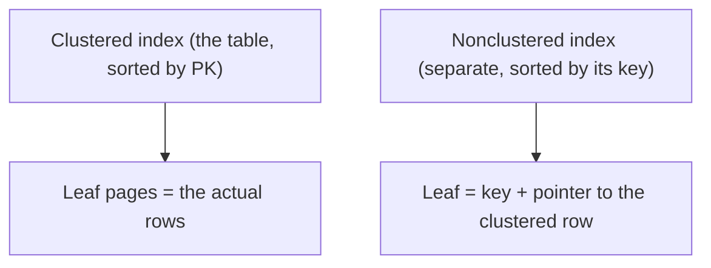

# Clustered, Nonclustered & Heaps

> A genuine architectural difference: 🟦 SQL Server tables are **clustered by default**; 🐘 PostgreSQL
> tables are **heaps**.

## 🧠 Intuition

Where are the actual table rows physically stored? Two models:

- **Clustered (SQL Server default):** the table's rows are **physically sorted and stored *in* the
  clustered index** — the index *is* the table, ordered by the clustering key. There's one per table
  (you can only sort the data one way).
- **Heap (PostgreSQL always; SQL Server tables without a clustered index):** rows are stored in **no
  particular order**; indexes are **separate** structures pointing at row locations.

> 💡 **Analogy — a sorted binder vs a pile of pages with sticky notes.** A clustered index is a
> binder where the pages *themselves* are kept in sorted order — find the section and the data is
> right there. A heap is a pile of pages in random order, with a separate sorted sticky-note index
> ("page 47 = Acme") telling you where each one is.

## 📐 SQL Server — clustered & nonclustered



- **Clustered index:** orders and stores the whole row. By default the **primary key** becomes the
  clustered index. **One per table.** Lookups by the clustering key land directly on the data.
- **Nonclustered index:** a separate B-tree sorted by *its* columns, whose leaves point back to the
  clustered row (via the clustering key). Finding a row needs a **key lookup** back to the clustered
  index unless the index **covers** the query (see [Covering Indexes](03.Covering-Filtered-Included.md)).
- **Heap (no clustered index):** rows unordered; nonclustered indexes point to a physical **RID**.

```sql
-- 🟦 SQL Server
CREATE CLUSTERED INDEX cx_orders ON orders (order_id);        -- usually the PK does this automatically
CREATE NONCLUSTERED INDEX ix_orders_customer ON orders (customer_id);
```

## 📐 PostgreSQL — heap + indexes (no clustered index)

PostgreSQL tables are **always heaps**. Every index — including the one backing the primary key — is
a **separate** structure pointing at heap tuples by their physical location (**ctid**). There is no
"clustered index" that reorders the table.

```sql
-- 🐘 PostgreSQL: PK creates a normal (separate) B-tree index; the table stays a heap
CREATE INDEX ix_orders_customer ON orders (customer_id);
```

🐘's **`CLUSTER`** command can *one-time* physically reorder a table to match an index — but it's
**not maintained**; new rows go wherever there's space, and you'd have to re-`CLUSTER` periodically.
It's a maintenance operation, not an ongoing clustered index.

```sql
-- 🐘: one-time physical reorder by an index (not auto-maintained)
CLUSTER orders USING ix_orders_customer;
```

## 🟦 SQL Server vs 🐘 PostgreSQL

| Concept | 🟦 SQL Server | 🐘 PostgreSQL |
|---------|--------------|---------------|
| Table storage | Clustered index (sorted) **or** heap | **Always a heap** |
| PK creates | A **clustered** index (by default) | A **separate** B-tree (table stays a heap) |
| "Clustered index" | First-class, auto-maintained, one per table | None; `CLUSTER` is a one-time reorder |
| Secondary index leaf points to | Clustering key | Heap **ctid** (physical location) |
| Extra lookup for non-covered index | **Key lookup** to clustered index | **Heap fetch** by ctid |

> The practical upshot: on **🟦**, choosing the **clustering key** is a big design decision (it affects
> every nonclustered index and range-scan performance). On **🐘**, there's no such choice — all
> indexes are equal "secondary" indexes over the heap, and you rely on **covering indexes** /
> index-only scans for the same benefit.

## 📐 Choosing a clustering key (SQL Server)

Because the clustered index orders the whole table and every nonclustered index carries the
clustering key, a good clustering key is:
- **Narrow** (small — it's duplicated into every nonclustered index),
- **Unique** (avoids extra "uniquifier" overhead),
- **Static** (rarely changes — changing it physically moves the row),
- **Ever-increasing** (like an `IDENTITY`) to avoid page-split fragmentation on insert.

An `INT`/`BIGINT IDENTITY` PK ticks all these boxes — which is why it's the common default. Avoid
clustering on a wide, random key like a `UNIQUEIDENTIFIER` (random GUID) — it fragments badly.

## ⚡ Performance implications

- **🟦 clustered range scans are fast** — rows for a key range are physically adjacent (e.g.
  clustering `orders` by `order_date` makes date-range reports sequential).
- **Key lookups (🟦) / heap fetches (🐘)** add cost when an index doesn't **cover** the query — the
  engine finds the key in the index, then fetches the rest of the row elsewhere. Covering indexes
  eliminate this (next file).
- **🐘 index-only scans** are the heap-world equivalent of covering: if the index has all needed
  columns *and* the visibility map says the page is all-visible, 🐘 skips the heap entirely.

## 🚫 Common mistakes

```sql
-- ❌ 🟦: clustering on a random GUID → constant page splits, fragmentation, slow inserts
CREATE TABLE t (id UNIQUEIDENTIFIER DEFAULT NEWID() PRIMARY KEY);   -- clustered on random GUID
-- ✅ cluster on an ever-increasing key (IDENTITY); use NEWSEQUENTIALID() if you need a GUID PK

-- ❌ 🟦: leaving a big table as a heap (no clustered index) → inefficient lookups, forwarded records
-- ✅ give most tables a clustered index (usually the PK)

-- ❌ Assuming PostgreSQL has a clustered index that stays sorted
-- ✅ it's a heap; CLUSTER is one-time; use covering indexes for index-only scans

-- ❌ Wide clustering key → bloats every nonclustered index (each carries the clustering key)
-- ✅ keep the clustering key narrow
```

## 🌍 Real-World Use

On SQL Server, clustering-key choice shapes the performance of the entire table and is a deliberate
design step (usually: narrow ever-increasing surrogate PK; or a range key like date for
time-series). On PostgreSQL, you design **secondary and covering indexes** and rely on index-only
scans, occasionally running `CLUSTER`/`pg_repack` to physically reorganize a heavily-scanned table.

## 🎯 Practice (with full solutions)

### 1. Pick a clustering key — `Medium`
**Task (🟦):** A `events` table is queried mostly by `event_time` ranges ("events in the last hour")
and inserted in time order. What clustering key?
**Solution:**
```sql
-- Cluster by event_time (ever-increasing, matches the range-scan access pattern)
CREATE CLUSTERED INDEX cx_events_time ON events (event_time, event_id);
```
**Why it works:** clustering on `event_time` stores rows physically in time order, so range queries
read **sequential** pages (fast), and time-ordered inserts append to the end (minimal page splits).
The `event_id` tiebreaker keeps the key unique.

### 2. Explain the engine difference — `Easy`
**Task:** A developer says "add a clustered index on `customer_id` in PostgreSQL to speed up
customer lookups." What do you tell them?
**Solution:** PostgreSQL has **no clustered index** — tables are heaps. Create a normal index on
`customer_id` (a separate B-tree); for a covered query, add the needed columns with `INCLUDE` to get
an **index-only scan**. If physical ordering really helps a big scan, `CLUSTER orders USING
ix_orders_customer` reorders it once (but it won't stay ordered as rows change).
**Why it matters:** the clustered-index concept simply doesn't exist in 🐘; the equivalent benefits
come from covering/index-only scans and occasional `CLUSTER`/`pg_repack`.

## ✅ Key Takeaways

- **🟦 SQL Server:** tables are **clustered** (rows stored in clustered-index order, one per table,
  usually the PK) or **heaps**; nonclustered indexes point back via the clustering key (→ **key
  lookups**).
- **🐘 PostgreSQL:** tables are **always heaps**; every index (including the PK's) is **separate**,
  pointing at heap **ctid**s; `CLUSTER` is a one-time reorder, not maintained.
- 🟦 **clustering-key choice matters** — narrow, unique, static, ever-increasing (an `IDENTITY` PK).
- Eliminate extra lookups/heap fetches with **covering indexes** (🟦) / **index-only scans** (🐘) —
  next file.

**Self-check:**
1. What's the difference between a clustered index and a heap?
2. Why does PostgreSQL not have a clustered index, and what does it use instead?
3. What makes a good SQL Server clustering key?

---
◀ Prev: [How Indexes Work](01.How-Indexes-Work.md) · ▲ [Module index](README.md) · ▶ Next: [Covering, Filtered & Included](03.Covering-Filtered-Included.md)
