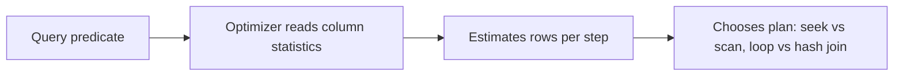

# Statistics & Cardinality

## 🧠 Intuition

Before running a query, the optimizer **guesses how many rows** each step will produce — its
**cardinality estimate** — and uses those guesses to choose indexes, join algorithms, and memory.
Those guesses come from **statistics**: summaries (histograms) of how values are distributed in each
column. Good statistics → good estimates → good plans. **Stale statistics** → wrong estimates → bad
plans (a fast query suddenly goes slow for "no reason").

> 💡 **Analogy — planning a road trip with an outdated map.** The optimizer plans the route based on
> its map of the data (statistics). If the map says "this road has 10 cars" but it now has 10,000
> (the table grew, stats are stale), it'll route you into a traffic jam (a nested-loop join that
> explodes). Keeping the map current keeps the routes good.

## 📐 What statistics contain

For a column (or index), the database stores a **histogram**: the range of values, how many distinct
values exist, and how rows are distributed across buckets. From this it estimates "how many rows
match `WHERE city = 'Berlin'`" without counting them.



The key derived number is **selectivity** — what fraction of rows a predicate keeps. High
selectivity (few rows, like `WHERE id = 5`) → favor an **index seek**. Low selectivity (most rows,
like `WHERE active = 1` when 99% are active) → a **scan** may be cheaper than millions of lookups.

## 🟦 SQL Server vs 🐘 PostgreSQL

| Concept | 🟦 SQL Server | 🐘 PostgreSQL |
|---------|--------------|---------------|
| Auto-create stats | `AUTO_CREATE_STATISTICS` (on by default) | created by `ANALYZE` / autovacuum's auto-analyze |
| Auto-update stats | `AUTO_UPDATE_STATISTICS` (on by default) | **autovacuum** runs `ANALYZE` automatically |
| Manual update | `UPDATE STATISTICS table;` / `sp_updatestats` | `ANALYZE table;` |
| Inspect | `DBCC SHOW_STATISTICS('table','stat')` | `pg_stats` view; `pg_statistic` |
| Sampling | sampled by default (full scan optional) | `default_statistics_target` controls sample size |
| Plan cache impact | stale stats can pin a bad cached plan (see below) | re-plans more readily |

Both engines **automatically maintain** statistics in the background — but auto-update triggers on a
*threshold* of changed rows, so a table that just had a huge bulk load or grew rapidly may have
**stale stats** until the threshold trips. That's when you update them manually.

## 💻 Updating statistics

```sql
-- 🟦 SQL Server
UPDATE STATISTICS orders;                 -- all stats on the table
UPDATE STATISTICS orders WITH FULLSCAN;   -- more accurate (scans all rows)
EXEC sp_updatestats;                      -- database-wide

-- 🐘 PostgreSQL
ANALYZE orders;                           -- refresh stats for one table
ANALYZE;                                  -- whole database
-- Increase sample detail for a skewed column:
ALTER TABLE orders ALTER COLUMN status SET STATISTICS 1000;   -- then ANALYZE
```

After a **big data change** (bulk load, large delete, mass update), **update statistics manually** —
don't wait for the auto-threshold. It's a common fix for "the query was fast yesterday."

## 📐 Cardinality estimation pitfalls

The optimizer estimates well for simple predicates but struggles with:
- **Correlated columns** — `WHERE city = 'Berlin' AND country = 'Germany'` (city implies country); the
  optimizer assumes independence and under-estimates. 🐘 supports **extended statistics**
  (`CREATE STATISTICS`) to capture correlations; 🟦 has multi-column stats and density.
- **Non-SARGable predicates** — a function on a column ([SARGability](05.SARGability.md)) leaves the
  optimizer guessing → poor estimates.
- **Parameter sniffing (🟦)** — the cached plan was optimized for the *first* parameter value; a later
  atypical value reuses that plan badly. Mitigate with `OPTION (RECOMPILE)`, `OPTIMIZE FOR`, or plan
  guides.
- **Stale stats after growth** — the classic cause of sudden regressions.

## ⚡ Reading the symptom in a plan

In the [execution plan](04.Reading-Execution-Plans.md), compare **Estimated Rows vs Actual Rows** on
each operator. A large mismatch (estimated 1, actual 2,000,000) is the fingerprint of a statistics/
estimation problem — and it explains why the optimizer chose, say, a nested-loop join that then
exploded. Fixing the estimate (update stats, make predicates SARGable, add extended stats) fixes the
plan.

## 🚫 Common mistakes

```sql
-- ❌ Bulk-loading millions of rows and not updating stats → optimizer still thinks the table is tiny
-- ✅ UPDATE STATISTICS / ANALYZE after big loads

-- ❌ Blaming "the index" when the real issue is stale statistics → wrong estimates → wrong plan
-- ✅ check estimated vs actual rows in the plan first

-- ❌ 🐘: ignoring autovacuum/auto-analyze on a high-churn table → stale stats + bloat
-- ✅ ensure autovacuum is keeping up; ANALYZE manually after big changes

-- ❌ 🟦: parameter sniffing causing one query shape to be fast for some values, slow for others
-- ✅ OPTION (RECOMPILE) for volatile predicates, or OPTIMIZE FOR a representative value
```

## 🌍 Real-World Use

"The query was fast last week and is slow now, with no code change" is almost always **stale
statistics** (the table grew/changed and estimates went wrong) or **parameter sniffing**. Updating
statistics is a frontline fix. On high-churn PostgreSQL tables, tuning autovacuum's analyze cadence
keeps estimates fresh. For correlated columns (a known weak spot), extended/multi-column statistics
rescue bad plans.

## 🎯 Practice (with full solutions)

### 1. Diagnose a sudden slowdown — `Medium`
**Task:** After a nightly bulk import, a previously-fast query is now slow. The plan shows estimated
1 row but actual 5 million on a key operator. What's the cause and fix?
**Solution:** the import added millions of rows but **statistics are stale** — the optimizer still
estimates the old (tiny) cardinality, so it picked a plan (e.g. nested loops) that's catastrophic at
the real size. Fix:
```sql
-- 🟦
UPDATE STATISTICS imported_table WITH FULLSCAN;
-- 🐘
ANALYZE imported_table;
```
Re-run the query; with accurate estimates the optimizer picks an appropriate plan (e.g. hash join).
**Why it works:** refreshing statistics corrects the cardinality estimate — the root cause — so the
optimizer's choices become sensible again.

### 2. Help the optimizer with correlation — `Medium`
**Task (🐘):** `WHERE city = 'Berlin' AND country = 'Germany'` is badly under-estimated (city
determines country, but the optimizer assumes independence). Improve the estimate.
**Solution:**
```sql
-- 🐘 PostgreSQL: extended statistics capture the column correlation
CREATE STATISTICS stx_city_country (dependencies) ON city, country FROM customers;
ANALYZE customers;
```
**Why it works:** extended statistics tell the optimizer that `city` and `country` are dependent, so
it stops multiplying their selectivities as if independent — producing a realistic estimate and a
better plan. (🟦 uses multi-column statistics/index density for similar effect.)

## ✅ Key Takeaways

- The optimizer relies on **statistics** (value-distribution histograms) to estimate **cardinality**
  (rows per step) and choose plans.
- Both engines **auto-maintain** stats (🟦 auto-update; 🐘 autovacuum's auto-analyze) — but on a
  **threshold**, so update manually after **big data changes** (`UPDATE STATISTICS` / `ANALYZE`).
- **Stale stats = wrong estimates = bad plans** — the classic "fast yesterday, slow today."
- Diagnose via **estimated-vs-actual rows** in the execution plan.
- Watch for **correlated columns** (use extended/multi-column stats) and **parameter sniffing** (🟦).

**Self-check:**
1. What are statistics, and how does the optimizer use them?
2. Why might a query regress with no code change, and what's the first fix to try?
3. What plan symptom indicates a statistics/estimation problem?

---
◀ Prev: [SARGability](05.SARGability.md) · ▲ [Module index](README.md) · ▶ Next: [Index Maintenance](07.Index-Maintenance.md)
