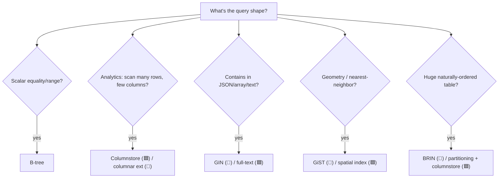

# Specialized Indexes

> Beyond the B-tree: each engine has index types tuned for specific data shapes. This is a big area
> of divergence — 🐘 especially has a rich index toolbox.

## 🧠 Intuition

The default B-tree is great for ordered, scalar values (numbers, dates, strings). But some data
doesn't fit that mold: analytics over billions of rows, JSON/array containment, full-text search,
huge append-only tables, geospatial queries. For these, both engines offer **specialized index
types** that B-trees can't match.

> 💡 **Analogy — specialized tools.** A B-tree is a great general-purpose wrench. But for a hex bolt
> you want a hex key (GIN for "contains"), for huge ordered ranges a tiny summary (BRIN), for
> analytics a columnar layout (columnstore). Using the right specialized tool turns an impossible
> job easy.

## 📐 The catalog (by engine)

| Use case | 🟦 SQL Server | 🐘 PostgreSQL |
|----------|--------------|---------------|
| General scalar lookups | B-tree (clustered/nonclustered) | B-tree |
| **Analytics over many rows** | **Columnstore index** | (columnar via extensions, e.g. Citus; or just BRIN + parallel) |
| **JSON/array/full-text "contains"** | (XML/JSON indexes; full-text catalog) | **GIN** (inverted index) |
| **Geospatial / ranges / nearest** | Spatial index (`GEOGRAPHY`/`GEOMETRY`) | **GiST** / **SP-GiST** (PostGIS uses GiST) |
| **Huge append-only / time-series** | columnstore; partitioning | **BRIN** (block range index) |
| **Equality only, fast** | (hash via in-memory OLTP) | **Hash** index |
| Full-text search | Full-Text Search catalog | GIN over `tsvector` ([Full-Text Search](../08-Specialized-Data/05.Full-Text-Search.md)) |

## 💻 🐘 PostgreSQL — the rich toolbox

```sql
-- GIN: inverted index for "contains" over jsonb, arrays, full-text
CREATE INDEX ix_products_tags_gin ON products USING GIN (tags);          -- tags is an array/jsonb
SELECT * FROM products WHERE tags @> '["sale"]';                          -- containment uses the GIN index

-- GIN over a tsvector for full-text search
CREATE INDEX ix_docs_fts ON documents USING GIN (to_tsvector('english', body));

-- GiST: ranges, geometry, nearest-neighbor (PostGIS uses this)
CREATE INDEX ix_locations_geom ON locations USING GiST (geom);

-- BRIN: tiny index for huge, naturally-ordered tables (e.g. append-only by timestamp)
CREATE INDEX ix_events_time_brin ON events USING BRIN (event_time);

-- Hash: equality-only lookups (rarely better than B-tree; WAL-logged since PG 10)
CREATE INDEX ix_sessions_token_hash ON sessions USING HASH (token);
```

**BRIN** deserves a highlight: for a billion-row time-series table where rows are inserted in
timestamp order, a BRIN index is **tiny** (it stores min/max per block range, not per row) yet
prunes huge swaths of the table for range queries — a fraction of a B-tree's size for the right
workload.

## 💻 🟦 SQL Server — columnstore for analytics

SQL Server's flagship specialized index is the **columnstore** — it stores data **column-by-column**
(compressed) instead of row-by-row, which is dramatically faster for analytic queries that scan many
rows but few columns (sums, counts, group-bys over millions of rows):

```sql
-- Clustered columnstore: the whole table stored columnar (great for a data warehouse fact table)
CREATE CLUSTERED COLUMNSTORE INDEX cci_sales ON sales;

-- Nonclustered columnstore: columnar index alongside a rowstore table (HTAP — OLTP + analytics)
CREATE NONCLUSTERED COLUMNSTORE INDEX ncci_orders ON orders (order_date, customer_id, total);
```

Columnstore gives **10–100×** speedups on analytic aggregations plus heavy compression, because a
`SUM(total)` reads only the compressed `total` column, skipping the rest. (See
[Columnstore & Analytics Indexing](../07-Partitioning-and-Scale/02.Columnstore-and-Analytics-Indexing.md).)

> PostgreSQL has no built-in columnstore; for columnar analytics you use extensions (Citus, Hydra) or
> external engines. Conversely, SQL Server lacks 🐘's GIN/GiST/BRIN richness — it leans on B-tree +
> columnstore + full-text/spatial/XML/JSON indexes.

## ⚖️ Choosing the right index type



Default to **B-tree**; reach for a specialized index only when the data shape and query pattern
clearly call for it.

## 🚫 Common mistakes

```sql
-- ❌ 🐘: using a GIN index for scalar equality (it's for containment/full-text) → wrong tool
-- ✅ B-tree for scalar = / range; GIN for @>, jsonb, arrays, full-text

-- ❌ 🐘: BRIN on a randomly-ordered column → useless (BRIN needs natural physical ordering)
-- ✅ BRIN only for columns correlated with physical row order (e.g. append-only timestamp)

-- ❌ 🟦: columnstore on a small, highly-transactional table → overhead with no benefit
-- ✅ columnstore for large analytic/fact tables; rowstore B-tree for OLTP

-- ❌ 🐘: hash index expecting it to beat B-tree generally (it rarely does; no range support)
-- ✅ B-tree is the safe default; hash only for pure-equality hotspots
```

## 🌍 Real-World Use

- **Columnstore (🟦):** data-warehouse fact tables, reporting databases — analytic aggregations fly.
- **GIN (🐘):** JSON document filtering (`@>`), tag/array search, full-text — the backbone of
  search-y features in PostgreSQL apps.
- **GiST (🐘) / spatial (🟦):** maps, "stores within 5km," geometry — PostGIS is the gold standard.
- **BRIN (🐘):** IoT/log/time-series tables that only grow, queried by recent time ranges — huge
  tables, tiny indexes.

## 🎯 Practice (with full solutions)

### 1. Index a JSON/array "contains" query — `Medium`
**Task (🐘):** `SELECT * FROM products WHERE tags @> '["sale"]'` (tags is `jsonb`) scans the table.
Speed it up.
**Solution:**
```sql
-- 🐘 PostgreSQL: GIN index supports the @> containment operator
CREATE INDEX ix_products_tags ON products USING GIN (tags);
SELECT * FROM products WHERE tags @> '["sale"]';   -- now uses the GIN index
```
**Why it works:** GIN is an **inverted index** — it maps each element (e.g. `"sale"`) to the rows
containing it, exactly what containment queries need. A B-tree can't index "contains this element."

### 2. Speed up an analytics aggregation — `Medium`
**Task (🟦):** A reporting query `SELECT category_id, SUM(total) FROM sales GROUP BY category_id`
scans 50M rows and is slow. Fix it.
**Solution:**
```sql
-- 🟦 SQL Server: columnstore — columnar storage + compression, ideal for scan-heavy aggregation
CREATE NONCLUSTERED COLUMNSTORE INDEX ncci_sales ON sales (category_id, total);
-- (or a CLUSTERED COLUMNSTORE if the table is primarily analytic)
```
**Why it works:** the columnstore reads only the compressed `category_id` and `total` columns and
processes them in batches, skipping all other columns — typically a 10–100× speedup over a rowstore
scan for this kind of aggregate. (On 🐘, you'd use partitioning + parallelism, BRIN, or a columnar
extension.)

## ✅ Key Takeaways

- Beyond B-tree, specialized indexes target specific shapes — and the engines **diverge a lot** here.
- **🟦's flagship is the columnstore** (columnar, compressed) for analytics — 10–100× on aggregations.
- **🐘 has a rich toolbox:** **GIN** (containment/JSON/array/full-text), **GiST/SP-GiST** (geometry/
  ranges/nearest, PostGIS), **BRIN** (tiny indexes for huge naturally-ordered tables), **hash**
  (equality).
- Match the index to the **query shape**; default to **B-tree** and specialize only when justified.
- 🐘 lacks built-in columnstore; 🟦 lacks GIN/GiST/BRIN richness — know each engine's strengths.

**Self-check:**
1. When is a columnstore index the right choice, and which engine has it built in?
2. What query pattern does a GIN index serve, and why can't a B-tree do it?
3. What makes BRIN tiny, and what's its prerequisite to be useful?

---
◀ Prev: [Index Maintenance](07.Index-Maintenance.md) · ▲ [Module index](README.md) · ▶ Next module: [07 — Partitioning & Scale](../07-Partitioning-and-Scale/01.Table-Partitioning.md)
