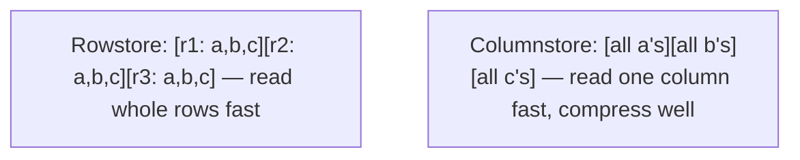

# Columnstore & Analytics Indexing

## 🧠 Intuition

Normal tables store data **row by row** (rowstore) — great for OLTP, where you read/write whole rows
("get this customer's record"). But **analytics** does the opposite: scan *millions of rows* but only
*a few columns* ("sum total sales by month"). For that, **column-oriented storage** wins massively:
store each column together, compressed, so an aggregate reads only the columns it needs and skips the
rest.

> 💡 **Analogy — a spreadsheet read down vs across.** OLTP reads *across* a row (one person's full
> record). Analytics reads *down* a column (everyone's "sales" value). If the data is physically
> stored column-by-column, reading down a column is sequential and tiny — you don't drag along 40
> other columns you don't need.

## 📐 Rowstore vs columnstore



| | Rowstore (B-tree) | Columnstore |
|--|-------------------|-------------|
| Best for | OLTP: point lookups, whole-row read/write | OLAP: scan many rows, few columns, aggregate |
| Compression | Modest | **Excellent** (similar values adjacent) |
| Aggregate scans | Read all columns of all rows | Read only needed columns, in **batches** |
| Single-row update | Fast | Slower (columnar isn't update-friendly) |

Columnstore gives **10–100× speedups** on analytic aggregations plus heavy compression, because
`SUM(total)` touches only the compressed `total` column and processes it in vectorized **batch mode**.

## 💻 🟦 SQL Server — columnstore indexes (first-class)

```sql
-- Clustered columnstore: the entire table stored columnar (ideal for a warehouse FACT table)
CREATE CLUSTERED COLUMNSTORE INDEX cci_sales ON sales;

-- Nonclustered columnstore: a columnar index alongside a rowstore table (HTAP: OLTP + analytics)
CREATE NONCLUSTERED COLUMNSTORE INDEX ncci_orders ON orders (order_date, customer_id, total);

-- The analytic query now uses batch-mode columnstore execution
SELECT category_id, SUM(total) AS revenue
FROM sales GROUP BY category_id;
```

- **Clustered columnstore** = the whole table is columnar — for large, mostly-read fact tables.
- **Nonclustered columnstore** = keep the rowstore for OLTP *and* add a columnar index for analytics
  on the same table (**HTAP** — hybrid transactional/analytical).
- Pairs beautifully with **[partitioning](01.Table-Partitioning.md)** (columnstore per partition) for
  warehouse-scale fact tables.

## 💻 🐘 PostgreSQL — no built-in columnstore

PostgreSQL is **row-oriented** and has **no built-in columnstore**. For columnar analytics you use:

- **Extensions:** **Citus** (columnar storage + distributed/sharded analytics), **Hydra**, or
  **cstore_fdw** (older). These add columnar tables to PostgreSQL.
- **Native techniques:** **[BRIN indexes](../06-Indexing-and-Performance/08.Specialized-Indexes.md)** for huge ordered tables,
  aggressive **parallel query**, **partitioning**, and **materialized views** for pre-aggregation.
- **External analytics engines:** offload heavy OLAP to a column store like **ClickHouse**,
  **DuckDB**, or a cloud warehouse, keeping PostgreSQL for OLTP.

```sql
-- 🐘 with the Citus columnar extension (example shape)
CREATE TABLE sales (...) USING columnar;     -- columnar storage for analytics
```

> This is a real architectural gap to know: **SQL Server has best-in-class built-in columnstore;
> PostgreSQL relies on extensions or external engines for true columnar analytics.** For a Postgres
> shop doing heavy analytics, this often means a separate analytical store.

## ⚖️ When to use columnstore

- ✅ **Data warehouse / reporting fact tables** — millions+ rows, scan-and-aggregate queries.
- ✅ **Read-mostly analytic workloads** — batch loads, infrequent updates.
- ✅ **Star-schema fact tables** ([DW Design](../12-DataWarehousing-BI-and-Ecosystem/01.Data-Warehouse-Design.md)).
- 🚫 **OLTP tables** with frequent single-row updates/point lookups — rowstore B-tree is far better.
- 🚫 **Small tables** — the overhead isn't worth it.

> The classic split: **rowstore for OLTP, columnstore for OLAP.** Many systems use both — 🟦's
> nonclustered columnstore on a rowstore table (HTAP), or separate OLTP (PostgreSQL) and OLAP
> (warehouse) databases.

## 🚫 Common mistakes

```sql
-- ❌ 🟦: clustered columnstore on a high-update OLTP table → slow updates, delta-store overhead
-- ✅ columnstore for analytic/fact tables; rowstore for transactional tables

-- ❌ Expecting PostgreSQL to have a built-in columnstore
-- ✅ use Citus/Hydra columnar, BRIN+parallelism, or an external OLAP engine

-- ❌ Putting OLAP aggregations on the OLTP B-tree and wondering why it scans 50M rows
-- ✅ columnstore (🟦) or a dedicated analytical store / materialized view

-- ❌ Tiny columnstore index that never gets the batch-mode benefit
-- ✅ columnstore pays off at scale (large row counts)
```

## 🌍 Real-World Use

- **🟦 columnstore:** the backbone of SQL Server data warehouses and reporting databases — fact tables
  with billions of rows, dashboards that aggregate in milliseconds, often partitioned by date.
- **HTAP (🟦):** a nonclustered columnstore on a live OLTP `orders` table so real-time dashboards run
  without a separate ETL/warehouse.
- **🐘 analytics:** Citus for scale-out analytical PostgreSQL, or offloading to ClickHouse/DuckDB/cloud
  warehouse while PostgreSQL handles transactions.

## 🎯 Practice (with full solutions)

### 1. Accelerate a warehouse aggregation — `Medium`
**Task (🟦):** A 100M-row `sales` fact table powers dashboards doing `SUM`/`GROUP BY`. Make them fast.
**Solution:**
```sql
-- 🟦 SQL Server: clustered columnstore on the fact table
CREATE CLUSTERED COLUMNSTORE INDEX cci_sales ON sales;
-- Now: SELECT region, SUM(amount) FROM sales GROUP BY region;  → columnar batch-mode scan
```
**Why it works:** columnar storage + compression + batch-mode execution means the aggregate reads
only the compressed columns it needs — a 10–100× speedup over a rowstore scan, exactly the warehouse
use case.

### 2. Analytics on PostgreSQL — `Medium`
**Task (🐘):** You need fast aggregations over a huge events table on PostgreSQL. There's no
columnstore. What are your options?
**Solution:**
- **Pre-aggregate** with a [materialized view](../03-Modifying-Data-and-DDL/05.Views-and-Materialized-Views.md)
  refreshed periodically (fast reads of summarized data).
- **Partition + BRIN + parallel query** to prune and scan huge ordered tables efficiently.
- **Citus/Hydra columnar** extension for true columnar storage, or **offload** heavy OLAP to
  ClickHouse/DuckDB/a cloud warehouse.
```sql
CREATE MATERIALIZED VIEW daily_revenue AS
SELECT date_trunc('day', event_time) AS d, SUM(amount) AS revenue FROM events GROUP BY 1;
-- refresh nightly; dashboards read the small MV instantly
```
**Why it works:** PostgreSQL lacks built-in columnstore, so you reach for pre-aggregation (MVs),
partition pruning, columnar extensions, or a dedicated analytical engine — the standard Postgres
analytics playbook.

## ✅ Key Takeaways

- **Columnstore** stores data **column-by-column**, compressed — **10–100× faster** for analytic
  scan-and-aggregate queries; poor for single-row OLTP updates.
- **🟦 has first-class columnstore** (clustered for fact tables, nonclustered for **HTAP**), great with
  partitioning.
- **🐘 has no built-in columnstore** — use **Citus/Hydra** columnar, **BRIN + partitioning +
  parallelism**, **materialized views**, or an **external OLAP engine**.
- The split: **rowstore for OLTP, columnstore for OLAP** — many systems run both.

**Self-check:**
1. Why is columnar storage so much faster for `SUM`/`GROUP BY` over many rows?
2. When should you *not* use a columnstore?
3. What are PostgreSQL's options for columnar/analytics workloads, given it has no built-in
   columnstore?

---
◀ Prev: [Table Partitioning](01.Table-Partitioning.md) · ▲ [Module index](README.md) · ▶ Next: [Scaling Out](03.Scaling-Out.md)
