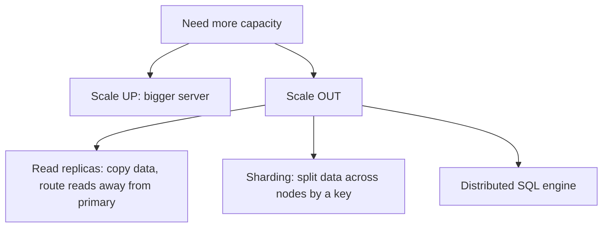

# Scaling Out

## 🧠 Intuition

There are two ways to handle more load: **scale up** (a bigger server — more CPU/RAM/disk) or **scale
out** (spread the work across multiple servers). Scaling up is simplest and gets you far, but has a
ceiling and gets expensive. Scaling out — **read replicas**, **sharding**, distributed engines —
removes the ceiling but adds complexity (consistency, routing, operations). Knowing the options and
their trade-offs is senior-level database architecture.

> 💡 **Analogy — a busy restaurant.** Scale up: hire a faster, stronger chef and buy a bigger stove.
> Scale out: open more kitchens (replicas for reading the menu / serving) or split the menu across
> specialized kitchens (sharding — pizza here, sushi there). More kitchens = more capacity, but now
> you must coordinate them.

## 📐 The scaling toolbox



| Technique | Scales | Adds |
|-----------|--------|------|
| **Scale up** | Everything (to a ceiling) | Cost; single point of failure |
| **Read replicas** | **Reads** (writes stay on primary) | Replication lag (eventual consistency) |
| **Sharding** | Reads **and** writes | Routing logic; cross-shard queries are hard |
| **Distributed SQL** | Reads and writes, transparently | Operational complexity; cost |

## 📐 Read replicas — scale reads

The most common first step. The **primary** handles writes and **replicates** to one or more
read-only **replicas**; you route read-heavy traffic (reports, dashboards, search) to the replicas,
freeing the primary for writes.

- **🟦 SQL Server:** **Always On Availability Groups** with readable secondaries; failover for HA too.
- **🐘 PostgreSQL:** **streaming replication** (physical) creates hot-standby read replicas; **logical
  replication** replicates selected tables (and across versions). Tools like **Patroni** automate
  failover.

> ⚠️ **Replication lag** = replicas are slightly behind the primary (asynchronous by default). A read
> right after a write may not see it ("read-your-writes" problem). Route reads that tolerate
> staleness to replicas; send reads that need the latest write to the primary, or use **synchronous**
> replication (slower writes) where strict consistency is required.

## 📐 Sharding — scale writes too

Replicas don't scale **writes** (every write still hits the primary). **Sharding** splits the data
itself across nodes by a **shard key** — e.g. customers A–M on node 1, N–Z on node 2, or by
`tenant_id`, `region`, or a hash. Each shard is an independent database handling its slice of reads
*and* writes.

- **Hard parts:** choosing a shard key that distributes evenly and matches query patterns;
  **cross-shard queries/joins** (slow or impossible); **cross-shard transactions** (distributed,
  complex); rebalancing when a shard gets hot.
- **🐘:** **Citus** turns PostgreSQL into a distributed, sharded database (transparent sharding +
  parallel queries). 
- **🟦:** sharding is typically app-managed, or via **Elastic Database tools** / **PolyBase** for
  some scenarios; Azure SQL has **Hyperscale** for scale-up-to-100TB without manual sharding.

> **Shard only when you must.** Sharding adds enormous complexity. Exhaust scale-up + read replicas +
> caching + query tuning first; shard when a single primary genuinely can't handle the **write**
> volume.

## 📐 Distributed SQL & cloud options

A newer category — **distributed SQL** databases present one logical database across many nodes with
automatic sharding and distributed transactions:
- **CockroachDB**, **YugabyteDB** (PostgreSQL-compatible), **Google Spanner**, **Citus** (PostgreSQL).
- **Cloud-managed scale:** Azure SQL **Hyperscale**, Amazon **Aurora** (separates compute/storage,
  fast replicas), read-replica fleets — get scale-out benefits without running it yourself.

## ⚖️ A practical scaling ladder

1. **Tune first** — indexes, SARGability, query rewrites, caching. Most "we need to scale" problems
   are really "we have a missing index" or "we N+1." Cheapest win by far.
2. **Scale up** — bigger box. Simple, no app changes.
3. **Add read replicas** — offload read-heavy traffic; accept replication lag.
4. **Cache** — a layer (Redis) in front for hot reads.
5. **Shard / distributed SQL** — only when writes genuinely exceed one node.

Each step adds complexity — climb only as far as you need.

## 🚫 Common mistakes

```text
❌ Sharding prematurely → massive complexity for a problem a bigger server + an index would solve.
✅ Tune → scale up → replicas → cache → shard, in that order.

❌ Routing read-your-writes traffic to a lagging replica → users don't see their own changes.
✅ send must-be-fresh reads to the primary; tolerate-stale reads to replicas.

❌ Choosing a shard key that's skewed (one hot shard) or doesn't match queries (cross-shard everything).
✅ pick a key that distributes evenly AND matches your common query filters.

❌ Assuming replicas help write throughput → they don't (writes stay on the primary).
✅ replicas scale READS; only sharding/distributed SQL scales writes.
```

## 🌍 Real-World Use

- **Read replicas** are the standard first scale-out step almost everywhere — reporting and read APIs
  hit replicas, the primary handles writes.
- **Sharding/Citus/distributed SQL** for multi-tenant SaaS at scale, global apps, and write-heavy
  systems that outgrow one node.
- **Cloud-managed** (Aurora, Azure SQL Hyperscale) is how most teams get scale-out without operating
  the machinery themselves.

## 🎯 Practice (with full solutions)

### 1. Pick the right scaling step — `Easy`
**Task:** Reports are hammering the production database and slowing the order-taking write path. What
do you do?
**Solution:** add a **read replica** and route reporting/read-only traffic to it, keeping the primary
free for writes. (🟦: readable secondary in an Availability Group; 🐘: a streaming-replication
hot-standby.) Accept that reports may be slightly stale (replication lag) — fine for reporting.
**Why it works:** the contention is **reads vs writes** on one server; replicas scale reads and
isolate them from the write path — the textbook first scale-out move, far simpler than sharding.

### 2. Decide whether to shard — `Medium`
**Task:** A multi-tenant SaaS on PostgreSQL is hitting write limits on a single primary; the biggest
tenants generate most of the load. What's the path?
**Solution:** Since the bottleneck is **writes** (not reads), replicas won't help. First confirm
tuning/caching is exhausted. Then **shard by `tenant_id`** so each node owns a set of tenants and
handles their writes independently — using **Citus** (transparent sharding for PostgreSQL) or
app-managed sharding. Pick `tenant_id` because queries almost always filter by tenant (so most
queries stay single-shard, avoiding cross-shard joins).
**Why it works:** sharding is the only thing that scales **writes**; `tenant_id` distributes load and
matches the query pattern, keeping the painful cross-shard operations rare.

## ✅ Key Takeaways

- **Scale up** (bigger server) is simplest; **scale out** removes the ceiling but adds complexity.
- **Read replicas** scale **reads** (🟦 Always On readable secondaries / 🐘 streaming replication) —
  beware **replication lag** (route fresh-read traffic to the primary).
- **Sharding** scales **reads *and* writes** by splitting data on a **shard key** — but cross-shard
  joins/transactions are hard; **Citus** does this for PostgreSQL.
- **Distributed SQL** (CockroachDB/Yugabyte/Spanner) and **cloud-managed** (Aurora, Hyperscale) offer
  scale-out with less operational burden.
- **Climb the ladder in order:** tune → scale up → replicas → cache → shard. Don't shard prematurely.

**Self-check:**
1. Why do read replicas not help write throughput?
2. What's replication lag, and how do you handle read-your-writes?
3. What makes a good shard key, and why exhaust other options before sharding?

---
◀ Prev: [Columnstore & Analytics Indexing](02.Columnstore-and-Analytics-Indexing.md) · ▲ [Module index](README.md) · ▶ Next module: [08 — Specialized Data](../08-Specialized-Data/01.JSON.md)
