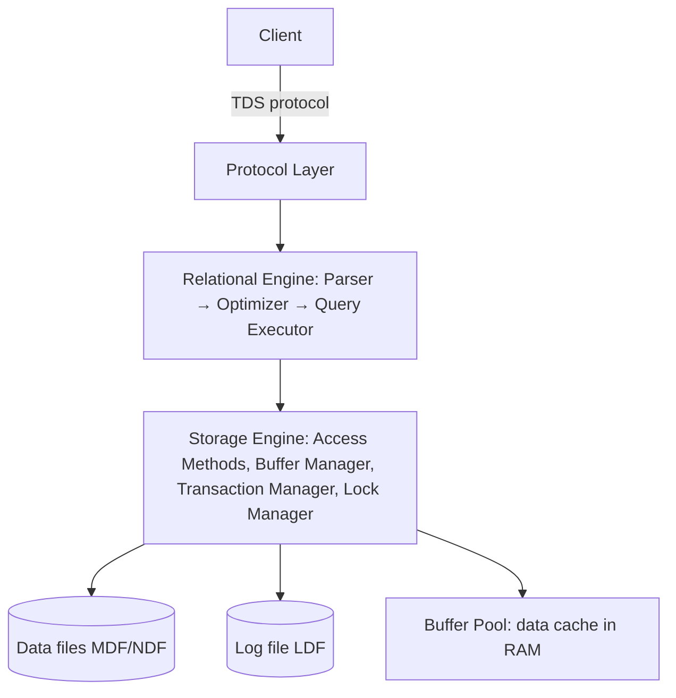

# SQL Server Architecture

## 🧠 Intuition

To reason about performance and reliability, you need a mental model of what happens *inside* SQL
Server when a query arrives. It's a layered machine: a **protocol layer** receives your request, a
**relational engine** parses and optimizes it into a plan, and a **storage engine** fetches/stores
the actual data — using a **buffer pool** in memory to avoid disk where possible, and a
**transaction log** to guarantee durability.

> 💡 **Analogy — a restaurant kitchen.** The host (protocol layer) takes your order. The head chef
> (query optimizer) decides the best way to prepare it. The line cooks (storage engine) fetch
> ingredients — from the counter (buffer pool / memory) if available, else the pantry (disk). And a
> running ticket log (transaction log) records every step so nothing is lost if the power flickers.

## 📐 The layers

### Protocol layer
SQL Server speaks **TDS (Tabular Data Stream)** over TCP/IP, Named Pipes, or Shared Memory. Clients
(SSMS, ADO.NET, JDBC) send TDS requests; results come back as TDS.

### Relational engine (the "query processor")
- **Parser** — checks syntax, builds a tree.
- **Algebrizer** — resolves names/types.
- **Query Optimizer** — a **cost-based** optimizer that considers many possible plans (which indexes,
  join order, join algorithms) using [statistics](../06-Indexing-and-Performance/06.Statistics-and-Cardinality.md)
  and picks the cheapest. The result is the **execution plan**, cached in the **plan cache** for reuse.
- **Query Executor** — runs the chosen plan, calling the storage engine for data.

### Storage engine
- **Access methods** — read/write rows, pages, indexes.
- **Buffer Manager** — manages the **buffer pool**.
- **Transaction Manager** — ACID, the log, commit/rollback.
- **Lock Manager** — concurrency ([locking/blocking](../05-Transactions-and-Concurrency/03.Locking-Blocking-Deadlocks.md)).

## 📐 Memory: the buffer pool & plan cache

- **Buffer pool** — the big in-memory cache of **data pages** (8 KB each). Reads check the buffer pool
  first; a hit avoids disk. The **Page Life Expectancy (PLE)** counter and **buffer cache hit ratio**
  tell you how well memory is serving reads. Most of SQL Server's RAM goes here.
- **Plan cache** — compiled execution plans, reused across executions of the same query shape (so it
  doesn't re-optimize every time). Relates to **parameter sniffing** (a cached plan optimized for one
  parameter value reused for others).

## 📐 Storage: pages, extents, files

- Data is stored in **8 KB pages** (the fundamental I/O unit); 8 contiguous pages = an **extent** (64
  KB).
- **Data files:** `.mdf` (primary), `.ndf` (additional) — organized into **filegroups**.
- **Log file:** `.ldf` — the **transaction log**, written **before** data pages change (write-ahead
  logging) to guarantee durability and enable rollback/recovery.
- **tempdb** — a system database used for **temp tables**, **sorts/hashes** that spill, **row
  versioning** (snapshot isolation / `READ_COMMITTED_SNAPSHOT`), and internal work. A hot tempdb is a
  common bottleneck — size and place it carefully.

## 📐 The write path & durability (WAL)

SQL Server uses **write-ahead logging**: a change is written to the **transaction log first** (and
the log record flushed to disk on `COMMIT`), *then* the modified data pages in the buffer pool are
written to data files later by a background **checkpoint**. This is why a committed transaction
survives a crash (the log can redo it) — see [Storage & Memory](03.Storage-and-Memory.md).

## ⚖️ High availability (intro)

SQL Server's HA/DR options (detailed in [HA & Replication](05.High-Availability-and-Replication.md)):
- **Always On Availability Groups** — replicas with automatic failover + readable secondaries.
- **Failover Cluster Instances** — shared-storage instance failover.
- **Log Shipping** / **Replication** — older/alternative approaches.

## 🌍 Why this matters in practice

- **"My query is slow"** → the optimizer chose a plan based on statistics; understanding the relational
  engine explains *why* (and how to influence it via indexes/SARGability).
- **"The server is using all the RAM"** → that's the **buffer pool** caching data — normal and good;
  low **Page Life Expectancy** means memory pressure.
- **"tempdb is hammered"** → sorts/spills/version store; a key tuning target.
- **"Will I lose data on a crash?"** → no, if it committed — **WAL** guarantees it via the log.

## 🎯 Practice (with full solutions)

### 1. Trace a query through the layers — `Easy`
**Task:** Describe what happens when you run `SELECT * FROM orders WHERE customer_id = 5`.
**Solution:** The client sends the query as **TDS** to the **protocol layer**. The **relational
engine** parses it, the **optimizer** uses statistics to pick a plan (e.g. an index seek on
`customer_id`), caching it in the **plan cache**. The **executor** asks the **storage engine** for the
rows; the **buffer manager** returns pages from the **buffer pool** if cached, else reads them from
the `.mdf` **data file**. Results stream back as TDS.
**Why it matters:** this end-to-end trace is the mental model for all SQL Server performance reasoning.

### 2. Explain the RAM "problem" — `Easy`
**Task:** Ops reports "SQL Server is using 90% of server RAM — is that a leak?"
**Solution:** No — that's the **buffer pool** caching data pages to avoid disk I/O, which is exactly
what you want. SQL Server deliberately uses available memory (up to `max server memory`). Check **Page
Life Expectancy** / **buffer cache hit ratio** — high values mean memory is serving reads well. Set
`max server memory` to leave room for the OS; don't "fix" the RAM usage.
**Why it works:** understanding the buffer pool reframes "high RAM" from a problem into healthy
caching.

## ✅ Key Takeaways

- SQL Server is layered: **protocol (TDS) → relational engine (parser/optimizer/executor) → storage
  engine (buffer/transaction/lock managers)**.
- The **cost-based optimizer** uses **statistics** to pick a plan, cached in the **plan cache**.
- The **buffer pool** caches **8 KB data pages** in RAM (high RAM use = healthy caching); **tempdb**
  handles temp objects, spills, and version store.
- **Write-ahead logging** (transaction log `.ldf` written before data files) guarantees durability;
  **checkpoints** flush data pages later.
- Data lives in **`.mdf`/`.ndf`** files organized into **filegroups**.

**Self-check:**
1. What are the three main layers, and what does each do?
2. What is the buffer pool, and why is high RAM usage normal?
3. How does write-ahead logging guarantee a committed transaction survives a crash?

---
◀ Prev: [Module index](README.md) · ▲ [Module index](README.md) · ▶ Next: [PostgreSQL Architecture](02.PostgreSQL-Architecture.md)
