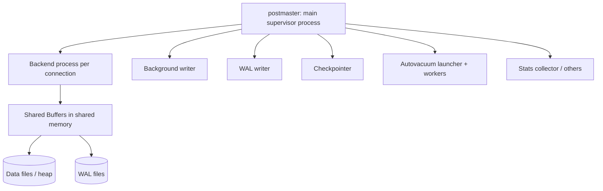

# PostgreSQL Architecture

## 🧠 Intuition

PostgreSQL's architecture differs from SQL Server in a few defining ways: it's **process-based**
(each connection gets its own OS process), it uses **MVCC** so writes create new row versions (which
is why it needs `VACUUM`), and it relies heavily on the **OS filesystem cache** alongside its own
**shared buffers**. Understanding these explains PostgreSQL's behavior — non-blocking reads, table
bloat, the importance of connection pooling.

> 💡 **Analogy — a workshop of independent craftspeople.** SQL Server is one big factory with threads;
> PostgreSQL hires a separate craftsperson (process) per customer (connection). That's robust (one
> crashing doesn't take down others) but means hiring is expensive (process startup) — so you keep a
> pool of them ready (connection pooling).

## 📐 The process model

PostgreSQL uses a **multi-process** architecture (not multi-threaded):

- **postmaster** — the supervisor; listens for connections and forks a backend per client.
- **Backend process** — handles one connection's queries (parse → plan → execute). One process per
  connection.
- **Background processes:** **WAL writer** (flushes the write-ahead log), **checkpointer** (writes
  dirty pages to data files), **background writer**, **autovacuum** workers (reclaim MVCC dead
  tuples), stats collector.

> ⚠️ Because each connection is a **process** (with real memory + startup cost), PostgreSQL doesn't
> handle thousands of direct connections well. **Use a connection pooler** (PgBouncer, or your app's
> pool) — this is a core operational practice, more critical than on thread-based SQL Server.

## 📐 The query path

A backend process runs each query through: **Parser** → **Rewriter** (applies rules/views) →
**Planner/Optimizer** (cost-based, uses [statistics](../06-Indexing-and-Performance/06.Statistics-and-Cardinality.md))
→ **Executor**. Like SQL Server, it's cost-based, but PostgreSQL re-plans more readily and supports
**prepared statements** for plan reuse (rather than an automatic plan cache shared across the server).

## 📐 Memory: shared buffers + OS cache

- **`shared_buffers`** — PostgreSQL's own cache of data pages (8 KB each), in shared memory. Typically
  set to ~25% of RAM.
- **OS filesystem cache** — crucially, PostgreSQL **also relies on the operating system's page cache**
  for much of its caching. So effective cache = `shared_buffers` + OS cache. This is why you *don't*
  set `shared_buffers` to all your RAM (unlike SQL Server's buffer pool) — you leave room for the OS
  cache.
- **`work_mem`** — per-operation memory for sorts/hashes (per query step, so be careful with many
  concurrent queries). **`maintenance_work_mem`** — for VACUUM/index builds.

## 📐 Storage & MVCC

- Data is stored in **8 KB pages** in **heap** files (tables are always heaps — see
  [Clustered vs Heaps](../06-Indexing-and-Performance/02.Clustered-Nonclustered-Heaps.md)). Large
  files are split into 1 GB segments.
- **TOAST** — oversized field values (big text/JSON/bytea) are transparently compressed and stored
  out-of-line in a TOAST table.
- **MVCC** — every `UPDATE`/`DELETE` creates a new row version and marks the old one dead (via
  `xmin`/`xmax`). **Readers never block writers**. The cost: **dead tuples accumulate** → **bloat** →
  must be reclaimed by **VACUUM** (see [MVCC vs Lock-Based](../05-Transactions-and-Concurrency/04.MVCC-vs-Lock-Based.md)).

## 📐 WAL (Write-Ahead Log) & durability

PostgreSQL's **WAL** is its transaction log: changes are written to WAL **before** the data pages
they modify, and WAL is flushed on `COMMIT` — guaranteeing durability and enabling crash recovery and
replication. A **checkpoint** periodically flushes dirty shared-buffer pages to the heap files. WAL
also underpins **streaming replication** and **point-in-time recovery (PITR)** (see
[Backup & Restore](../11-Operations/01.Backup-and-Restore.md)).

## 🟦 SQL Server vs 🐘 PostgreSQL architecture

| Aspect | 🟦 SQL Server | 🐘 PostgreSQL |
|--------|--------------|---------------|
| Concurrency unit | Threads (one process) | **Process per connection** |
| Connection scaling | Handles many directly | **Needs a pooler** (PgBouncer) |
| Caching | Buffer pool (most of RAM) | `shared_buffers` (~25%) **+ OS cache** |
| Concurrency model | Lock-based (+ snapshot) | **MVCC always** (→ VACUUM) |
| Write-ahead log | Transaction log (`.ldf`) | **WAL** |
| Table storage | Clustered or heap | **Always heap** |
| Big values | LOB storage | **TOAST** |
| Background work | Lazy writer, checkpoint | autovacuum, WAL writer, checkpointer, bgwriter |

## 🌍 Why this matters in practice

- **Too many connections** → because each is a process, PostgreSQL can exhaust memory/CPU; **use a
  connection pooler** (the #1 PostgreSQL ops lesson).
- **Table bloat** → MVCC dead tuples not vacuumed; tune **autovacuum** ([Maintenance](../11-Operations/02.Maintenance.md)).
- **Memory tuning** → set `shared_buffers` to ~25% and **leave RAM for the OS cache** (don't copy SQL
  Server's "give it everything" approach).
- **Replication/PITR** → built on WAL.

## 🎯 Practice (with full solutions)

### 1. Diagnose a connection storm — `Medium`
**Task:** A PostgreSQL server with `max_connections = 500` is running out of memory under load, with
hundreds of mostly-idle app connections. What's happening and what's the fix?
**Solution:** Each connection is a **separate OS process** with its own memory; hundreds of them
exhaust RAM/CPU even when idle. The fix is a **connection pooler** (PgBouncer in transaction mode, or
the app's pool) so a small number of backend processes (say 20–50) serve many app connections, with
`max_connections` set modestly.
**Why it works:** pooling decouples "app connections" from "expensive backend processes," which is
necessary given PostgreSQL's process-per-connection model.

### 2. Set memory correctly — `Easy`
**Task:** On a 32 GB PostgreSQL server, a colleague set `shared_buffers = 30GB` "to cache
everything," and performance got worse. Why?
**Solution:** PostgreSQL relies on **both** `shared_buffers` **and the OS filesystem cache**. Setting
`shared_buffers` to nearly all RAM starves the OS cache (and other processes), causing double-caching
and memory pressure. Set `shared_buffers` to **~25% (8 GB)** and leave the rest for the OS cache and
`work_mem`.
**Why it works:** unlike SQL Server's buffer pool (which wants most of RAM), PostgreSQL's design
expects the OS cache to do much of the caching — so you deliberately leave RAM free.

## ✅ Key Takeaways

- PostgreSQL is **process-per-connection** (robust but expensive) → **always use a connection
  pooler**.
- Memory = **`shared_buffers` (~25%) + OS filesystem cache** — leave RAM for the OS (don't give it
  everything).
- **MVCC** makes reads non-blocking but creates **dead tuples → bloat → VACUUM** (autovacuum).
- **WAL** (write-ahead log) guarantees durability and powers replication + PITR; tables are **heaps**;
  big values go to **TOAST**.
- Background processes (**autovacuum**, WAL writer, checkpointer) keep it healthy.

**Self-check:**
1. Why does PostgreSQL need a connection pooler more than SQL Server does?
2. Why shouldn't you set `shared_buffers` to most of the server's RAM?
3. What is WAL, and what does it enable beyond durability?

---
◀ Prev: [SQL Server Architecture](01.SQL-Server-Architecture.md) · ▲ [Module index](README.md) · ▶ Next: [Storage & Memory](03.Storage-and-Memory.md)
