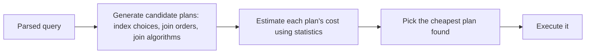

# The Query Optimizer

## 🧠 Intuition

The **query optimizer** is the brain of the database: given your declarative SQL, it figures out
*how* to execute it — which indexes to use, what order to join tables, which join algorithm, whether
to sort or hash. There are often **millions** of possible ways to run a single query, with wildly
different costs. The optimizer estimates the cost of candidate plans (using
[statistics](../06-Indexing-and-Performance/06.Statistics-and-Cardinality.md)) and picks the cheapest
it can find in reasonable time. This is what makes SQL **declarative** — you say *what*, it decides
*how*.

> 💡 **Analogy — a GPS routing engine.** You say "get me to the airport" (the query). The GPS knows
> thousands of possible routes, estimates each one's time using traffic data (statistics), and picks
> the fastest (the plan). Bad traffic data → bad route. The optimizer is that routing engine for your
> data.

## 📐 How it works (cost-based optimization)

Both engines use **cost-based optimizers**:



The optimizer's main decisions:
- **Access method:** index seek vs index scan vs table/heap scan, for each table.
- **Join order:** which tables to join first (hugely affects intermediate result sizes).
- **Join algorithm:** nested loops (small/indexed), hash join (large unindexed equality), merge join
  (pre-sorted) — see [Reading Execution Plans](../06-Indexing-and-Performance/04.Reading-Execution-Plans.md).
- **Other operators:** sort, aggregate (hash vs stream), spool, parallelism.

It assigns a **cost** to each plan (a relative unit, not real time) based on estimated rows and I/O,
and chooses the lowest. Because the search space is enormous, it uses heuristics and a time budget —
it finds a *good* plan, not always the theoretically perfect one.

## 📐 Statistics are everything

The optimizer's choices are only as good as its **cardinality estimates** (how many rows each step
produces), which come from **statistics**. Stale or missing stats → wrong estimates → bad plans (the
classic "fast yesterday, slow today"). Non-SARGable predicates also blind the optimizer. Keeping
statistics fresh and predicates SARGable is how you *help* the optimizer make good choices — you
don't usually override it.

## 📐 Plan caching & reuse

Optimizing is expensive, so plans are reused:

| | 🟦 SQL Server | 🐘 PostgreSQL |
|--|--------------|---------------|
| Reuse mechanism | **Plan cache** — compiled plans cached server-wide by query hash | **Prepared statements** — plan cached per prepared statement/session |
| Parameterization | Auto/forced parameterization; parameter sniffing | Generic vs custom plans for prepared statements |
| Recompile | `OPTION (RECOMPILE)`, plan guides | `PREPARE`/`DEALLOCATE`; `plan_cache_mode` |

### Parameter sniffing (🟦) / generic plans (🐘)

A cached plan is optimized for the **parameter values seen when it was compiled**. If a later
execution uses very different values (e.g. a customer with 10 rows vs one with 10 million), the
reused plan may be terrible for it. This is **parameter sniffing** (🟦) — and PostgreSQL has an
analogous **generic-vs-custom plan** decision for prepared statements.

Mitigations: `OPTION (RECOMPILE)` (re-optimize each run — for volatile predicates), `OPTIMIZE FOR`
(pin a representative value), or splitting the query. On 🐘, `plan_cache_mode = force_custom_plan`.

## 📐 Influencing the optimizer (carefully)

Prefer to **help** the optimizer (good indexes, fresh stats, SARGable queries) rather than override
it. When you must:
- **🟦 query hints:** `OPTION (HASH JOIN)`, `OPTION (MAXDOP n)`, `OPTION (RECOMPILE)`, index hints,
  **Query Store** forced plans.
- **🐘:** fewer hints by design (no native join hints); tune via `enable_*` GUCs (e.g.
  `enable_nestloop`), `default_statistics_target`, extended statistics, and the **pg_hint_plan**
  extension if absolutely needed.

> ⚠️ **Hints are a last resort.** They pin a decision that may be wrong as data changes. Fix the root
> cause (stats, indexes, query shape) first; hint only with evidence and a plan to revisit it.

## ⚖️ Why two engines pick different plans

SQL Server and PostgreSQL have **different optimizers, cost models, and statistics** — so the *same
query* on the *same data* can get different plans. Neither is "wrong"; they're tuned differently. This
is why porting a query between engines sometimes needs re-tuning (different indexes, different
predicates). Always check the plan on the actual target engine.

## 🚫 Common mistakes

```text
❌ Adding query hints to "fix" a slow query instead of diagnosing it → brittle, wrong as data grows.
✅ check the plan → fix stats/index/SARGability → hint only as a last resort.

❌ Blaming the optimizer when statistics are stale → it estimated wrong, so it chose wrong.
✅ update statistics; check estimated vs actual rows in the plan.

❌ Assuming a query that's fast for one parameter is fast for all (parameter sniffing).
✅ OPTION (RECOMPILE) / OPTIMIZE FOR (🟦), force_custom_plan (🐘) for volatile predicates.

❌ Expecting identical plans across SQL Server and PostgreSQL.
✅ different optimizers → re-check and re-tune on each engine.
```

## 🌍 Real-World Use

Understanding the optimizer turns performance tuning from guesswork into method: read the plan, see
what the optimizer chose and *why* (its row estimates), and fix the *inputs* (statistics, indexes,
SARGable predicates) so it chooses better. It also explains parameter-sniffing regressions ("works
for most users, times out for the big one") and why a ported query needs re-tuning on the other
engine.

## 🎯 Practice (with full solutions)

### 1. Diagnose a parameter-sniffing regression — `Medium`
**Task (🟦):** A stored procedure runs in 50ms for most customers but times out for one huge customer.
The plan was great for small customers. Explain and fix.
**Solution:** **Parameter sniffing** — the cached plan was compiled for a *small* customer (favoring
nested loops), and that plan is reused for the huge customer where a hash join would be far better.
Fix options:
```sql
-- Re-optimize each execution for its actual parameter (good for volatile predicates):
SELECT ... WHERE customer_id = @id OPTION (RECOMPILE);
-- Or pin a representative value:
... OPTION (OPTIMIZE FOR (@id = <typical_value>));
```
**Why it works:** `RECOMPILE` makes the optimizer build a fresh plan suited to *this* customer's
cardinality, eliminating the one-size-fits-all bad plan.

### 2. Help, don't hint — `Easy`
**Task:** A query does a table scan and is slow. A teammate wants to add an index hint to force a
seek. Better idea?
**Solution:** Don't force a seek with a hint — there may be **no usable index** (or the predicate is
non-SARGable). Instead: check the plan, **create the right index** (or make the predicate SARGable,
or update statistics). Then the optimizer will *choose* the seek on its own — robustly, even as data
changes.
**Why it works:** fixing the inputs lets the cost-based optimizer make the right choice naturally; a
hint just masks the missing index and breaks when data shifts.

## ✅ Key Takeaways

- The **cost-based optimizer** turns declarative SQL into an execution plan by estimating costs of
  candidate plans (access methods, join order, join algorithms) using **statistics**.
- **Good estimates → good plans** — keep statistics fresh and predicates SARGable; that's how you
  *help* the optimizer.
- Plans are **reused** (🟦 plan cache / 🐘 prepared statements) — beware **parameter sniffing** /
  generic plans; mitigate with `RECOMPILE`/`OPTIMIZE FOR` (🟦) or `force_custom_plan` (🐘).
- **Hints are a last resort** — fix root causes first.
- Different optimizers mean the **same query gets different plans** on SQL Server vs PostgreSQL —
  re-tune per engine.

**Self-check:**
1. What decisions does the optimizer make, and what does it use to choose?
2. What is parameter sniffing, and how do you mitigate it?
3. Why is fixing statistics/indexes/SARGability better than adding hints?

---
◀ Prev: [Storage & Memory](03.Storage-and-Memory.md) · ▲ [Module index](README.md) · ▶ Next: [High Availability & Replication](05.High-Availability-and-Replication.md)
