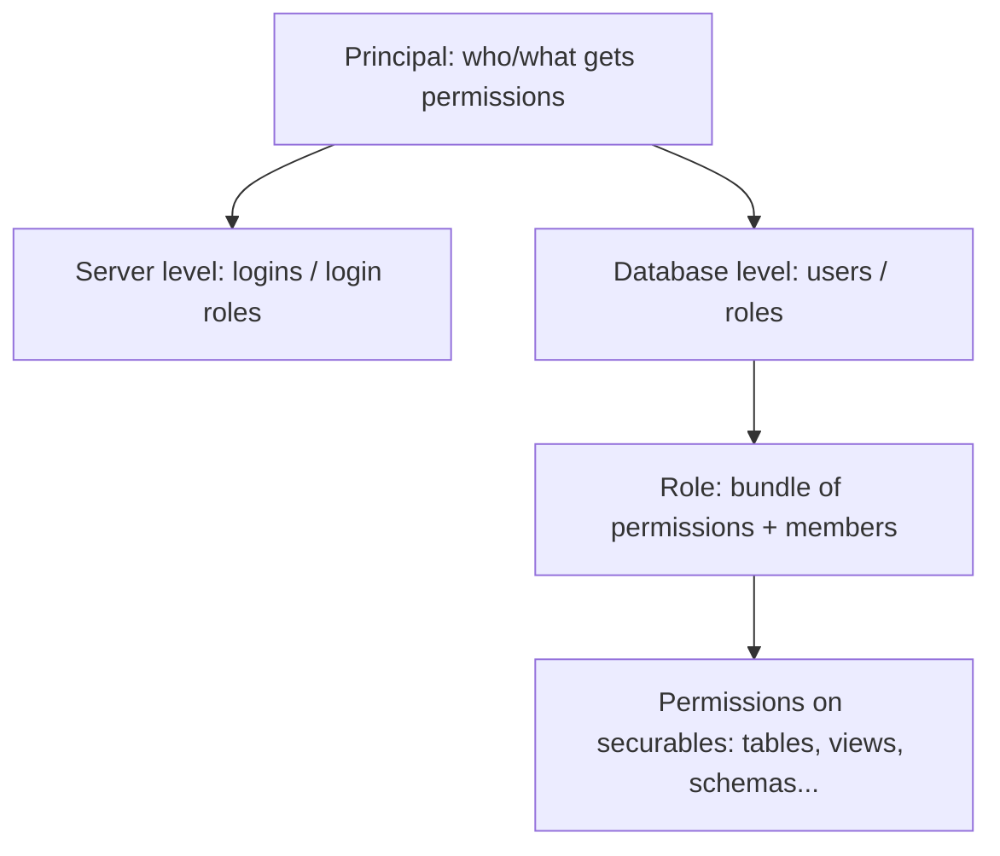

# Logins, Users & Roles

## 🧠 Intuition

Once authenticated, an identity needs to be represented *inside* the database so you can grant it
permissions. **Roles** are named bundles of privileges (or members) — instead of granting the same
20 permissions to 50 people, you grant them to a **role** once and add people to the role. The
engines differ in terminology: 🟦 separates **server-level logins** from **database-level users**; 🐘
unifies everything into **roles**.

> 💡 **Analogy — job titles vs individuals.** You don't write a custom access policy for each
> employee. You define roles ("Accountant," "Manager," "Read-Only Auditor") with set permissions, and
> assign people to roles. Hire someone? Give them a role. Their access is defined by the title, not by
> 50 individual grants. Roles make permissions manageable.

## 📐 The hierarchy



## 💻 🟦 SQL Server — login (server) → user (database) → role

SQL Server has a **two-level** model:
- A **login** authenticates at the **server** level.
- A login maps to a **user** in each **database** it accesses.
- Users are added to **roles** (fixed or custom) that carry permissions.

```sql
-- 1. Server-level login (authentication)
CREATE LOGIN app_login WITH PASSWORD = 'Strong_P@ssw0rd!';

-- 2. Database-level user mapped to that login
USE shop;
CREATE USER app_user FOR LOGIN app_login;

-- 3. Add the user to roles
-- Built-in (fixed) database roles:
ALTER ROLE db_datareader ADD MEMBER app_user;   -- read all tables
ALTER ROLE db_datawriter ADD MEMBER app_user;   -- write all tables

-- Custom role with specific permissions:
CREATE ROLE sales_readonly;
GRANT SELECT ON SCHEMA::Sales TO sales_readonly;
ALTER ROLE sales_readonly ADD MEMBER app_user;
```

**Fixed server roles:** `sysadmin` (god), `securityadmin`, `dbcreator`, etc.
**Fixed database roles:** `db_owner`, `db_datareader`, `db_datawriter`, `db_ddladmin`, etc.

> ⚠️ A common confusion: a **login without a user** in a database can authenticate to the server but
> can't access that database. And an **orphaned user** (whose login was dropped) can't log in.

## 💻 🐘 PostgreSQL — everything is a role

PostgreSQL has **one concept: the role**. A role can:
- **Log in** (if it has the `LOGIN` attribute — this is what 🟦 calls a "login").
- **Be a group** (a role without `LOGIN`, with other roles as members — like a 🟦 "role").
- **Own objects** and **hold permissions**.

```sql
-- A login role (a "user")
CREATE ROLE app_user WITH LOGIN PASSWORD 'Strong_P@ssw0rd!';

-- A group role (no login) that bundles permissions
CREATE ROLE sales_readonly;                       -- NOLOGIN by default
GRANT USAGE ON SCHEMA sales TO sales_readonly;
GRANT SELECT ON ALL TABLES IN SCHEMA sales TO sales_readonly;

-- Make the login role a member of the group → it inherits the permissions
GRANT sales_readonly TO app_user;

-- Role attributes
CREATE ROLE etl_user WITH LOGIN PASSWORD '...' CREATEDB;     -- can create databases
ALTER ROLE app_user WITH CONNECTION LIMIT 50;
```

There's no separate "login vs user" — a role with `LOGIN` *is* a user; a role without it serves as a
group. `CREATE USER` is just an alias for `CREATE ROLE ... LOGIN`. The superuser role (`postgres`) is
the equivalent of `sysadmin`.

## 🟦 SQL Server vs 🐘 PostgreSQL

| Concept | 🟦 SQL Server | 🐘 PostgreSQL |
|---------|--------------|---------------|
| Authentication principal | **Login** (server-level) | **Role with `LOGIN`** |
| Database principal | **User** (maps to a login) | (same role) |
| Group of permissions | **Role** (fixed or custom) | **Role without `LOGIN`** (group) |
| Membership | `ALTER ROLE r ADD MEMBER u` | `GRANT group_role TO member_role` |
| Superuser | `sysadmin` server role | `postgres` superuser role / `SUPERUSER` attr |
| Built-in roles | `db_datareader`, `db_datawriter`, ... | (no built-in data roles; you create them) — plus predefined roles like `pg_read_all_data` (PG 14+) |

## ⚖️ Designing roles (least privilege)

- **Create roles by job function**, not per person: `app_readwrite`, `reporting_readonly`,
  `etl_loader`, `dba`. Grant permissions to the role; add identities to roles.
- **Least privilege:** each role gets only what it needs. The app's runtime role should be
  `datareader + datawriter` on its tables — **not** `db_owner`/`sysadmin`/superuser.
- **Separate accounts** for app runtime vs migrations/DDL vs admin — so a compromised app account
  can't alter the schema.
- **No personal logins in apps** — apps use a dedicated service identity.

## 🚫 Common mistakes

```text
❌ App connects as sysadmin / db_owner / superuser → a SQL injection or bug can do ANYTHING.
✅ least-privilege role: read/write only the tables it needs.

❌ Granting permissions to individuals instead of roles → unmanageable, drifts over time.
✅ grant to roles; add/remove members.

❌ 🟦: orphaned users (login dropped) or login-without-user confusion → access problems.
✅ keep login↔user mapping consistent; fix orphans with ALTER USER ... WITH LOGIN.

❌ 🐘: granting table access but forgetting USAGE on the schema → "permission denied for schema".
✅ GRANT USAGE ON SCHEMA + the table privileges.
```

## 🌍 Real-World Use

Every production database has a small set of **function-based roles**: the app's runtime role
(read/write its tables), a reporting role (read-only, often on a replica), a migration/DDL role
(elevated, used only during deploys), and admin roles for DBAs. New services/people are mapped to
roles, never granted ad-hoc permissions. This keeps access auditable and least-privilege.

## 🎯 Practice (with full solutions)

### 1. Least-privilege app role — `Medium`
**Task:** The app currently connects as an admin. Create a role that can only read and write the
`Sales` schema's tables, and assign the app identity to it.
**Solution:**
```sql
-- 🟦 SQL Server
CREATE ROLE sales_rw;
GRANT SELECT, INSERT, UPDATE, DELETE ON SCHEMA::Sales TO sales_rw;
ALTER ROLE sales_rw ADD MEMBER app_user;     -- app_user no longer needs db_owner

-- 🐘 PostgreSQL
CREATE ROLE sales_rw;
GRANT USAGE ON SCHEMA sales TO sales_rw;                            -- don't forget schema USAGE!
GRANT SELECT, INSERT, UPDATE, DELETE ON ALL TABLES IN SCHEMA sales TO sales_rw;
ALTER DEFAULT PRIVILEGES IN SCHEMA sales GRANT SELECT, INSERT, UPDATE, DELETE ON TABLES TO sales_rw; -- future tables
GRANT sales_rw TO app_user;
```
**Why it works:** the role scopes the app to exactly the data operations it needs on one schema —
least privilege. The 🐘 version adds **schema `USAGE`** (required) and **default privileges** so
tables created *later* are covered automatically.

### 2. Explain the engine difference — `Easy`
**Task:** A SQL Server DBA moving to PostgreSQL asks "where do I create the login, and where the
user?"
**Solution:** In PostgreSQL there's no separate login/user — both are **roles**. Create a role with
`LOGIN` (that's the "login/user"), and create roles without `LOGIN` to act as permission "groups,"
then `GRANT group_role TO login_role` for membership. One concept replaces 🟦's two.
**Why it matters:** the unified role model is the main conceptual adjustment when moving between the
engines.

## ✅ Key Takeaways

- **Roles** bundle permissions/members so you grant once and assign many — the key to manageable
  access.
- **🟦:** two levels — **login** (server, authentication) → **user** (database) → **role**
  (permissions). Built-in `db_datareader`/`db_datawriter`/`db_owner`.
- **🐘:** **one concept — the role**; a role with `LOGIN` is a "user," a role without is a "group";
  membership via `GRANT role TO role`.
- **Design roles by job function** with **least privilege**; never run the app as
  `sysadmin`/`db_owner`/superuser; separate app vs DDL vs admin accounts.
- 🐘 gotcha: grant **schema `USAGE`** + use **default privileges** for future tables.

**Self-check:**
1. How does SQL Server's login/user model differ from PostgreSQL's role model?
2. Why grant permissions to roles instead of individuals?
3. What privileges should an application's runtime role actually have?

---
◀ Prev: [Authentication](01.Authentication.md) · ▲ [Module index](README.md) · ▶ Next: [Permissions](03.Permissions.md)
