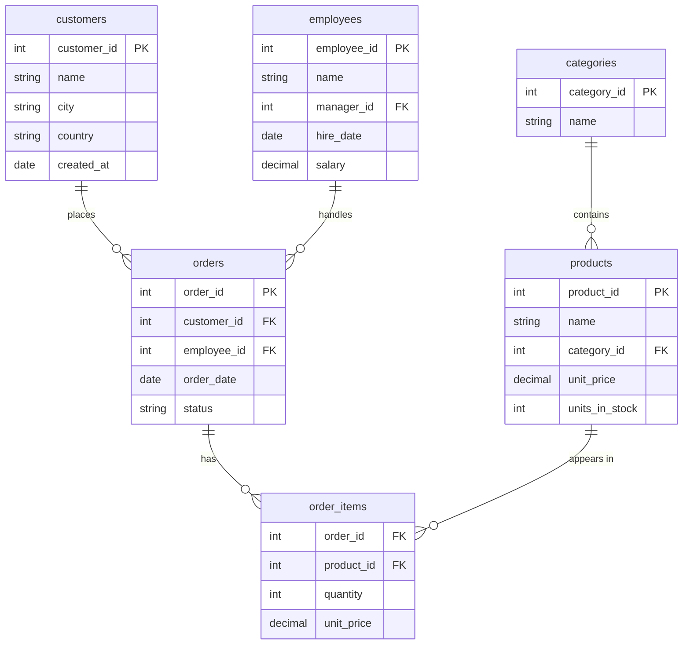

# The Sample Database

> **Every example in this course runs against this schema.** Set it up once in SQL Server and/or
> PostgreSQL, and you can copy-run every query you read.

## 🧠 What it models

A tiny **sales company**: customers place orders, orders contain line items for products, products
belong to categories, and employees handle orders. It's small enough to reason about, but rich
enough to demonstrate joins, aggregation, windows, indexing, and everything else.



> Note `employees.manager_id` is a **self-reference** (an employee's manager is another employee)
> — handy for recursive queries and self-joins later.

## 🟦 SQL Server setup

```sql
CREATE DATABASE SalesDemo;
GO
USE SalesDemo;
GO

CREATE TABLE categories (
    category_id INT IDENTITY PRIMARY KEY,
    name        NVARCHAR(50) NOT NULL UNIQUE
);

CREATE TABLE products (
    product_id     INT IDENTITY PRIMARY KEY,
    name           NVARCHAR(100) NOT NULL,
    category_id    INT NOT NULL REFERENCES categories(category_id),
    unit_price     DECIMAL(10,2) NOT NULL CHECK (unit_price >= 0),
    units_in_stock INT NOT NULL DEFAULT 0
);

CREATE TABLE customers (
    customer_id INT IDENTITY PRIMARY KEY,
    name        NVARCHAR(100) NOT NULL,
    city        NVARCHAR(50),
    country     NVARCHAR(50),
    created_at  DATE NOT NULL DEFAULT CAST(GETDATE() AS DATE)
);

CREATE TABLE employees (
    employee_id INT IDENTITY PRIMARY KEY,
    name        NVARCHAR(100) NOT NULL,
    manager_id  INT NULL REFERENCES employees(employee_id),
    hire_date   DATE NOT NULL,
    salary      DECIMAL(10,2) NOT NULL
);

CREATE TABLE orders (
    order_id    INT IDENTITY PRIMARY KEY,
    customer_id INT NOT NULL REFERENCES customers(customer_id),
    employee_id INT NULL REFERENCES employees(employee_id),
    order_date  DATE NOT NULL,
    status      NVARCHAR(20) NOT NULL DEFAULT 'Pending'
);

CREATE TABLE order_items (
    order_id   INT NOT NULL REFERENCES orders(order_id),
    product_id INT NOT NULL REFERENCES products(product_id),
    quantity   INT NOT NULL CHECK (quantity > 0),
    unit_price DECIMAL(10,2) NOT NULL,
    PRIMARY KEY (order_id, product_id)
);
```

## 🐘 PostgreSQL setup

```sql
CREATE DATABASE salesdemo;
\c salesdemo

CREATE TABLE categories (
    category_id INT GENERATED ALWAYS AS IDENTITY PRIMARY KEY,
    name        VARCHAR(50) NOT NULL UNIQUE
);

CREATE TABLE products (
    product_id     INT GENERATED ALWAYS AS IDENTITY PRIMARY KEY,
    name           VARCHAR(100) NOT NULL,
    category_id    INT NOT NULL REFERENCES categories(category_id),
    unit_price     NUMERIC(10,2) NOT NULL CHECK (unit_price >= 0),
    units_in_stock INT NOT NULL DEFAULT 0
);

CREATE TABLE customers (
    customer_id INT GENERATED ALWAYS AS IDENTITY PRIMARY KEY,
    name        VARCHAR(100) NOT NULL,
    city        VARCHAR(50),
    country     VARCHAR(50),
    created_at  DATE NOT NULL DEFAULT CURRENT_DATE
);

CREATE TABLE employees (
    employee_id INT GENERATED ALWAYS AS IDENTITY PRIMARY KEY,
    name        VARCHAR(100) NOT NULL,
    manager_id  INT REFERENCES employees(employee_id),
    hire_date   DATE NOT NULL,
    salary      NUMERIC(10,2) NOT NULL
);

CREATE TABLE orders (
    order_id    INT GENERATED ALWAYS AS IDENTITY PRIMARY KEY,
    customer_id INT NOT NULL REFERENCES customers(customer_id),
    employee_id INT REFERENCES employees(employee_id),
    order_date  DATE NOT NULL,
    status      VARCHAR(20) NOT NULL DEFAULT 'Pending'
);

CREATE TABLE order_items (
    order_id   INT NOT NULL REFERENCES orders(order_id),
    product_id INT NOT NULL REFERENCES products(product_id),
    quantity   INT NOT NULL CHECK (quantity > 0),
    unit_price NUMERIC(10,2) NOT NULL,
    PRIMARY KEY (order_id, product_id)
);
```

> Already a tour of dialect differences: **`INT IDENTITY`** (🟦) vs **`INT GENERATED ALWAYS AS
> IDENTITY`** (🐘); **`NVARCHAR`** (🟦) vs **`VARCHAR`/`text`** (🐘); **`DECIMAL`** vs **`NUMERIC`**
> (synonyms, but PG prefers `NUMERIC`); **`GETDATE()`** vs **`CURRENT_DATE`**. All covered in
> [Data Types](00-Foundations/04.Data-Types.md).

## 🌱 Seed data (works on both engines)

```sql
INSERT INTO categories (name) VALUES ('Beverages'), ('Snacks'), ('Electronics');

INSERT INTO products (name, category_id, unit_price, units_in_stock) VALUES
    ('Coffee',        1, 7.50,  120),
    ('Green Tea',     1, 5.00,  80),
    ('Potato Chips',  2, 2.25,  300),
    ('Chocolate Bar', 2, 1.75,  500),
    ('USB Cable',     3, 9.99,  60),
    ('Wireless Mouse',3, 19.99, 40);

INSERT INTO customers (name, city, country, created_at) VALUES
    ('Acme Corp',     'Berlin',  'Germany', '2025-01-10'),
    ('Globex',        'London',  'UK',      '2025-02-15'),
    ('Initech',       'Austin',  'USA',     '2025-03-01'),
    ('Umbrella Ltd',  'Berlin',  'Germany', '2025-03-20');

INSERT INTO employees (name, manager_id, hire_date, salary) VALUES
    ('Dana Director', NULL, '2020-01-05', 9000),
    ('Mike Manager',  1,    '2021-06-01', 6500),
    ('Sara Seller',   2,    '2022-09-12', 4200),
    ('Tom Trader',    2,    '2023-02-20', 4000);

INSERT INTO orders (customer_id, employee_id, order_date, status) VALUES
    (1, 3, '2025-04-01', 'Shipped'),
    (1, 4, '2025-04-15', 'Pending'),
    (2, 3, '2025-04-18', 'Shipped'),
    (3, 4, '2025-05-02', 'Cancelled'),
    (4, 3, '2025-05-10', 'Shipped');

INSERT INTO order_items (order_id, product_id, quantity, unit_price) VALUES
    (1, 1, 10, 7.50), (1, 3, 5, 2.25),
    (2, 5, 2, 9.99),
    (3, 2, 8, 5.00), (3, 4, 20, 1.75),
    (4, 6, 1, 19.99),
    (5, 1, 4, 7.50), (5, 5, 3, 9.99);
```

> If you used `GENERATED ALWAYS AS IDENTITY` on PostgreSQL, the `INSERT`s above work because they
> don't supply identity columns. (If you ever need to insert explicit IDs, use `GENERATED BY
> DEFAULT AS IDENTITY` instead — covered in [Identity & Sequences](03-Modifying-Data-and-DDL/04.Identity-and-Sequences.md).)

## ✅ Verify it loaded

```sql
SELECT COUNT(*) AS products  FROM products;    -- 6
SELECT COUNT(*) AS orders    FROM orders;      -- 5
SELECT COUNT(*) AS lineitems FROM order_items; -- 8
```

You're ready. Head to [00 — Foundations](00-Foundations/README.md).

---
▲ [Course home](README.md)
